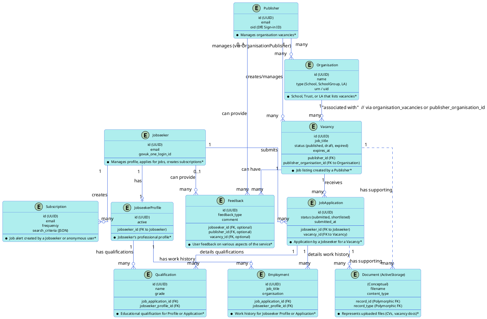

# Software Requirements Document: Teaching Vacancies

## Table of Contents
- [1. Introduction](#1-introduction)
  - [1.1 Purpose](#11-purpose)
  - [1.2 Scope](#12-scope)
  - [1.3 Definitions, Acronyms, and Abbreviations](#13-definitions-acronyms-and-abbreviations)
  - [1.4 References](#14-references)
  - [1.5 Overview](#15-overview)
- [2. Overall Description](#2-overall-description)
  - [2.1 Product Perspective](#21-product-perspective)
  - [2.2 Product Functions](#22-product-functions)
  - [2.3 User Classes and Characteristics](#23-user-classes-and-characteristics)
  - [2.4 Operating Environment](#24-operating-environment)
  - [2.5 Design and Implementation Constraints](#25-design-and-implementation-constraints)
  - [2.6 Assumptions and Dependencies](#26-assumptions-and-dependencies)
- [3. System Features (Functional Requirements)](#3-system-features-functional-requirements)
  - [3.1 User Authentication and Authorization](#31-user-authentication-and-authorization)
  - [3.2 Vacancy Management (Publisher Facing)](#32-vacancy-management-publisher-facing)
  - [3.3 Job Search and Filtering (Jobseeker Facing)](#33-job-search-and-filtering-jobseeker-facing)
  - [3.4 Job Application Process (Jobseeker and Publisher Facing)](#34-job-application-process-jobseeker-and-publisher-facing)
  - [3.5 Jobseeker Profile Management](#35-jobseeker-profile-management)
  - [3.6 Publisher (Organisation) Profile Management](#36-publisher-organisation-profile-management)
  - [3.7 Notifications and Alerts (System to User)](#37-notifications-and-alerts-system-to-user)
  - [3.8 Support User Functions](#38-support-user-functions)
  - [3.9 System Administration Functions](#39-system-administration-functions)
  - [3.10 Reporting and Analytics (Placeholder)](#310-reporting-and-analytics-placeholder)
- [4. External Interface Requirements](#4-external-interface-requirements)
  - [4.1 User Interfaces](#41-user-interfaces)
  - [4.2 Hardware Interfaces (Not Applicable)](#42-hardware-interfaces-not-applicable)
  - [4.3 Software Interfaces](#43-software-interfaces)
    - [4.3.1 DfE Sign-in](#431-dfe-sign-in)
    - [4.3.2 GOV.UK One Login](#432-govuk-one-login)
    - [4.3.3 DWP Find a Job Service](#433-dwp-find-a-job-service)
    - [4.3.4 Publisher ATS API](#434-publisher-ats-api)
    - [4.3.5 Google Services (reCAPTCHA, Drive)](#435-google-services-recaptcha-drive)
    - [4.3.6 GOV.UK Notify](#436-govuk-notify)
    - [4.3.7 ONS ArcGIS Service](#437-ons-arcgis-service)
  - [4.4 Communications Interfaces](#44-communications-interfaces)
- [5. Non-Functional Requirements](#5-non-functional-requirements)
  - [5.1 Performance Requirements](#51-performance-requirements)
  - [5.2 Scalability Requirements](#52-scalability-requirements)
  - [5.3 Availability and Reliability Requirements](#53-availability-and-reliability-requirements)
  - [5.4 Security Requirements](#54-security-requirements)
  - [5.5 Maintainability Requirements](#55-maintainability-requirements)
  - [5.6 Usability Requirements](#56-usability-requirements)
  - [5.7 Accessibility Requirements](#57-accessibility-requirements)
  - [5.8 Data Integrity Requirements](#58-data-integrity-requirements)
  - [5.9 Localization and Internationalization](#59-localization-and-internationalization)
  - [5.10 Operational Requirements](#510-operational-requirements)
- [6. Data Requirements](#6-data-requirements)
  - [6.1 Data Model Overview (Conceptual)](#61-data-model-overview-conceptual)
  - [6.2 Detailed Data Dictionary (Key Entities)](#62-detailed-data-dictionary-key-entities)
    - [6.2.1 Vacancies (`vacancies`)](#621-vacancies-vacancies)
    - [6.2.2 Jobseekers (`jobseekers`)](#622-jobseekers-jobseekers)
    - [6.2.3 Publishers (`publishers`)](#623-publishers-publishers)
    - [6.2.4 Organisations (`organisations`)](#624-organisations-organisations)
    - [6.2.5 Job Applications (`job_applications`)](#625-job-applications-job_applications)
    - [6.2.6 Jobseeker Profiles (`jobseeker_profiles`)](#626-jobseeker-profiles-jobseeker_profiles)
    - [6.2.7 Job Preferences (`job_preferences`)](#627-job-preferences-job_preferences)
    - [6.2.8 Job Preferences Locations (`job_preferences_locations`)](#628-job-preferences-locations-job_preferences_locations)
    - [6.2.9 Employments (`employments`)](#629-employments-employments)
    - [6.2.10 Qualifications (`qualifications`)](#6210-qualifications-qualifications)
    - [6.2.11 Qualification Results (`qualification_results`)](#6211-qualification-results-qualification_results)
    - [6.2.12 Personal Details (`personal_details`)](#6212-personal-details-personal_details)
    - [6.2.13 References (`references`)](#6213-references-references)
    - [6.2.14 Subscriptions (Job Alerts) (`subscriptions`)](#6214-subscriptions-job-alerts-subscriptions)
    - [6.2.15 Alert Runs (`alert_runs`)](#6215-alert-runs-alert_runs)
    - [6.2.16 Feedbacks (`feedbacks`)](#6216-feedbacks-feedbacks)
    - [6.2.17 Notes (`notes`)](#6217-notes-notes)
    - [6.2.18 Equal Opportunities Reports (`equal_opportunities_reports`)](#6218-equal-opportunities-reports-equal_opportunities_reports)
    - [6.2.19 Organisation Vacancies (`organisation_vacancies`)](#6219-organisation-vacancies-organisation_vacancies)
    - [6.2.20 Organisation Publishers (`organisation_publishers`)](#6220-organisation-publishers-organisation_publishers)
    - [6.2.21 School Group Memberships (`school_group_memberships`)](#6221-school-group-memberships-school_group_memberships)
    - [6.2.22 Local Authority Publisher Schools (`local_authority_publisher_schools`)](#6222-local-authority-publisher-schools-local_authority_publisher_schools)
    - [6.2.23 Publisher Preferences (`publisher_preferences`)](#6223-publisher-preferences-publisher_preferences)
    - [6.2.24 Markers (`markers`)](#6224-markers-markers)
    - [6.2.25 Location Polygons (`location_polygons`)](#6225-location-polygons-location_polygons)
    - [6.2.26 Emergency Login Keys (`emergency_login_keys`)](#6226-emergency-login-keys-emergency_login_keys)
    - [6.2.27 Publisher ATS API Clients (`publisher_ats_api_clients`)](#6227-publisher-ats-api-clients-publisher_ats_api_clients)
    - [6.2.28 Active Storage Attachments (`active_storage_attachments`)](#6228-active-storage-attachments-active_storage_attachments)
    - [6.2.29 Active Storage Blobs (`active_storage_blobs`)](#6229-active-storage-blobs-active_storage_blobs)
    - [6.2.30 Friendly ID Slugs (`friendly_id_slugs`)](#6230-friendly-id-slugs-friendly_id_slugs)
    - [6.2.31 Sessions (`sessions`)](#6231-sessions-sessions)
    - [6.2.32 Versions (`versions`)](#6232-versions-versions)
    - [6.2.33 Noticed Events (`noticed_events`)](#6233-noticed-events-noticed_events)
    - [6.2.34 Noticed Notifications (`noticed_notifications`)](#6234-noticed-notifications-noticed_notifications)
  - [6.3 Data Retention and Archival](#63-data-retention-and-archival)
- [7. Use Cases](#7-use-cases)
  - [7.1 UC-001: Jobseeker Searches for Vacancy](#71-uc-001-jobseeker-searches-for-vacancy)
  - [7.2 UC-002: Publisher Posts New Vacancy](#72-uc-002-publisher-posts-new-vacancy)
  - [7.3 UC-003: Jobseeker Applies for Vacancy](#73-uc-003-jobseeker-applies-for-vacancy)
  - [7.4 UC-004: Jobseeker Creates Job Alert](#74-uc-004-jobseeker-creates-job-alert)
  - [7.5 UC-005: Publisher Manages Organisation Profile](#75-uc-005-publisher-manages-organisation-profile)
  - [7.6 UC-006: Jobseeker Manages Personal Profile](#76-uc-006-jobseeker-manages-personal-profile)
  - [7.7 UC-007: Support User Manages User Feedback](#77-uc-007-support-user-manages-user-feedback)
  - [7.8 UC-008: Support User Manages Publisher ATS API Client](#78-uc-008-support-user-manages-publisher-ats-api-client)
  - [7.9 UC-009: System Sends Job Alert Email to Jobseeker](#79-uc-009-system-sends-job-alert-email-to-jobseeker)
  - [7.10 UC-010: System Exports Vacancies to DWP Find a Job](#710-uc-010-system-exports-vacancies-to-dwp-find-a-job)
- [Appendix A: Business Rules Catalogue](#appendix-a-business-rules-catalogue)
- [Appendix B: Data Migration Considerations](#appendix-b-data-migration-considerations)

## 1. Introduction

### 1.1 Purpose
This Software Requirements Document (SRD) specifies the requirements for the Teaching Vacancies service. The Teaching Vacancies service is a platform provided by the Department for Education (DfE) for schools and trusts in England to advertise their job vacancies, and for jobseekers (primarily teachers and education professionals) to find and apply for these positions.

This document is intended for a variety of stakeholders, including:
*   **Development Team:** To understand the features, business logic, and constraints for designing, building, and maintaining the software.
*   **Quality Assurance Team:** To develop test plans and test cases.
*   **Product Owners/Managers:** To define the scope and functionalities of the service.
*   **Future Development Teams:** To understand the system for potential rewrites, major enhancements, or ongoing maintenance.

This SRD aims to provide a comprehensive overview of the functional and non-functional requirements necessary to develop or re-implement the Teaching Vacancies service.

### 1.2 Scope
The scope of the Teaching Vacancies service includes:
*   Allowing authenticated publishers (school and Multi-Academy Trust staff) to create, manage, and publish job vacancies.
*   Allowing authenticated jobseekers to search for vacancies using various filters (location, role, subject, etc.), view vacancy details, save vacancies, and create job alerts.
*   Allowing jobseekers to apply for vacancies, either through an in-platform application process or by redirecting to an external application system (e.g., an ATS).
*   Providing user profile management for both jobseekers and publishers.
*   Integrating with DfE Sign-in for publisher authentication and GOV.UK One Login for jobseeker authentication.
*   Exporting vacancy data to the DWP "Find a job" service.
*   Providing an API (Publisher ATS API) for Applicant Tracking Systems to integrate with the service.
*   Sending notifications to users (e.g., job alerts, application confirmations) via GOV.UK Notify.
*   Providing administrative and support functionalities for DfE staff.

This document describes the existing system's requirements as a baseline for understanding its intended behavior, which would inform any future development or rewrite.

### 1.3 Definitions, Acronyms, and Abbreviations
Refer to the Glossary section in the [arc42 System Documentation](../arc42/arc42_template.md#12-glossary) for a comprehensive list of definitions, acronyms, and abbreviations. Key terms will also be defined within this document where first used if critical for immediate context.

### 1.4 References
*   [arc42 System Documentation](../arc42/arc42_template.md)
*   Existing source code for the Teaching Vacancies application.
*   Existing Architectural Decision Records (ADRs) in `/documentation/adr/`.
*   (Other DfE policies or standards documentation would be listed here if known and applicable).

### 1.5 Overview
The remainder of this document details the overall product description, specific functional requirements (system features), external interface requirements, non-functional requirements, data requirements, and key use cases. It aims to provide a clear and comprehensive specification for the Teaching Vacancies service.

## 2. Overall Description

### 2.1 Product Perspective
The Teaching Vacancies service is a key component of the Department for Education's digital offerings, designed to facilitate recruitment in the education sector in England. It replaces or complements previous methods of job advertising, aiming to be a central, free-to-use platform for schools and jobseekers.

The system is a standalone web application but integrates with critical national identity platforms (DfE Sign-in, GOV.UK One Login) and other government services (DWP Find a Job, GOV.UK Notify). It is an evolution of previous DfE job listing services and has undergone several technical iterations (e.g., in its search technology and integration approaches).

From a technical perspective, the current system is a Ruby on Rails monolithic application, hosted on Azure Kubernetes Service (AKS) within the DfE's Cloud Infrastructure Platform (CIP).

### 2.2 Product Functions
The major functions of the Teaching Vacancies service are:
*   **Vacancy Publication:** Enabling schools and trusts to advertise teaching and education-related roles.
*   **Job Search:** Allowing jobseekers to find relevant vacancies based on a wide range of criteria.
*   **Job Application (where applicable):** Facilitating the application process for jobseekers.
*   **Alerts and Notifications:** Keeping users informed about new vacancies or application status.
*   **User Account Management:** Allowing users to manage their profiles, preferences, and activities.
*   **Third-Party Integration:** Interfacing with external ATS and other government services.
*   **Support and Administration:** Providing tools for DfE support staff to manage the service and assist users.

These functions are detailed further in Section 3 (System Features).

### 2.3 User Classes and Characteristics

The Teaching Vacancies service caters to several distinct user classes:

*   **Jobseekers (e.g., Teachers, Teaching Assistants, Education Professionals):**
    *   **Characteristics:**
        *   Varying levels of technical proficiency, from novice to experienced computer users.
        *   Primarily motivated to find suitable job opportunities in educational institutions in England.
        *   May be actively looking for a new role or passively monitoring opportunities.
        *   Access the service from various devices (desktops, laptops, tablets, smartphones).
        *   Expect a user-friendly interface, efficient search tools, and clear information about vacancies.
        *   May require accessibility features.
    *   **Primary Activities:**
        *   Registering and managing their accounts (via GOV.UK One Login).
        *   Searching and browsing for job vacancies using various filters (location, subject, job role, working pattern, education phase, etc.).
        *   Viewing detailed information about specific vacancies.
        *   Saving vacancies of interest for later review.
        *   Creating and managing job alerts (subscriptions) to be notified of new relevant vacancies.
        *   Applying for vacancies, either through the platform's built-in application process or by being redirected to an external application site.
        *   Managing their jobseeker profile, including personal details, qualifications, work experience, and job preferences.

*   **Publishers (e.g., School Hiring Managers, School Administrators, Trust HR Staff, LA Recruitment Staff):**
    *   **Characteristics:**
        *   Typically possess moderate technical proficiency, using computers regularly for administrative tasks.
        *   Motivated to advertise job vacancies effectively to attract qualified candidates.
        *   Represent an educational institution (e.g., school, academy, Multi-Academy Trust, Local Authority).
        *   Require tools to easily create, manage, and track their job listings.
        *   Authenticated via DfE Sign-in.
    *   **Primary Activities:**
        *   Registering their organisation(s) (if not already present or managed centrally).
        *   Creating new job vacancy listings, providing detailed information (job title, description, salary, contract type, key dates, application process, etc.).
        *   Editing and updating existing vacancy listings.
        *   Closing or extending vacancy listings.
        *   Viewing applications submitted through the platform (for vacancies configured for in-platform applications).
        *   Managing their organisation's profile information.
        *   Utilizing a dashboard to view their active and past vacancies.
        *   Potentially interacting with features related to Applicant Tracking System (ATS) integrations.

*   **Support Users (DfE Staff):**
    *   **Characteristics:**
        *   DfE employees responsible for user support and operational oversight of the service.
        *   Possess good technical understanding of the service's functionality and administration.
        *   Authenticated via a DfE internal mechanism (likely DfE Sign-in with elevated privileges).
    *   **Primary Activities:**
        *   Accessing a dedicated support dashboard/interface.
        *   Viewing and managing user feedback (e.g., general feedback, job alert feedback).
        *   Assisting jobseekers and publishers with issues they encounter.
        *   Managing Publisher ATS API client access and configurations.
        *   Viewing service data and analytics (e.g., number of users, vacancies, applications).
        *   Potentially performing limited data correction or user account management tasks under strict guidelines.
        *   Monitoring system health and escalating issues to the technical team.

*   **System Administrators (DfE Technical Staff / Development Team):**
    *   **Characteristics:**
        *   Highly technically skilled individuals responsible for the maintenance, deployment, and advanced configuration of the system.
        *   Deep understanding of the application architecture, infrastructure, and codebase.
        *   Authenticated via secure DfE internal mechanisms with high levels of privilege.
    *   **Primary Activities:**
        *   Deploying new versions of the application.
        *   Managing and configuring the Azure infrastructure (AKS, PostgreSQL, Redis).
        *   Monitoring system performance, security, and logs at a detailed level.
        *   Performing database administration and maintenance tasks.
        *   Troubleshooting and resolving complex technical issues.
        *   Managing system secrets and security configurations.
        *   Implementing and testing disaster recovery procedures.
        *   Managing integrations with external services at a technical level.

### 2.4 Operating Environment
The Teaching Vacancies service operates in the following environment:
*   **Platform:** Azure Cloud Infrastructure Platform (CIP).
*   **Runtime:** Azure Kubernetes Service (AKS).
*   **Database:** Azure PostgreSQL Flexible Server.
*   **Caching/Job Queue:** Azure Cache for Redis.
*   **Web Browser Compatibility:** The service must be accessible and functional on modern, commonly used web browsers (e.g., latest versions of Chrome, Firefox, Edge, Safari) on desktop and mobile devices. Specific browser version support would need to be defined by DfE policy or based on user analytics.
*   **Accessibility:** The environment must support users with disabilities, requiring compliance with WCAG 2.1 Level AA.

### 2.5 Design and Implementation Constraints
Key design and implementation constraints are documented in the [arc42 System Documentation](../arc42/arc42_template.md#2-constraints). These include:
*   Mandatory use of DfE Sign-in for publishers and GOV.UK One Login for jobseekers.
*   Integration with DWP Find a Job service.
*   Adherence to GOV.UK Design System and accessibility standards.
*   Hosting on Azure CIP.
*   The current system is a Ruby on Rails monolith. A rewrite might choose a different stack (e.g., Java), which would then become a new implementation constraint for that version.

*(Further details on constraints specific to a rewrite, such as choice of Java framework, would be added here if this SRD were solely for a Java rewrite project.)*

### 2.6 Assumptions and Dependencies
*   **Availability of External Services:** The system depends on the continuous availability and correct functioning of DfE Sign-in, GOV.UK One Login, GOV.UK Notify, DWP Find a Job service, ONS ArcGIS, and Google Services.
*   **User Internet Access:** Users (jobseekers, publishers) are assumed to have reliable internet access and a compatible web browser.
*   **Data Accuracy from Publishers:** The accuracy of vacancy information relies on publishers providing correct and up-to-date details.
*   **DfE Policies:** The system must comply with prevailing DfE policies regarding data security, privacy, and service design.
*   **(For a rewrite context) Feature Parity Assumption:** A primary assumption for a rewrite would be the need to achieve functional parity with the existing system, unless specific deviations are explicitly approved.

## 3. System Features (Functional Requirements)

This section outlines the major functional capabilities of the Teaching Vacancies service, grouped by feature area or epic. Detailed functional requirements for each feature will be elaborated in subsequent analysis phases by examining specific controllers, models, and services.

### 3.1 User Authentication and Authorization
*   **Description:** Governs how users access the system and what actions they are permitted to perform.
*   **Jobseeker Specific Requirements:**
    *   **FR-JS-AUTH-001:** Jobseekers MUST be able to register and log in to the service using GOV.UK One Login.
    *   **FR-JS-AUTH-002:** Upon successful authentication via GOV.UK One Login, the system MUST create a local Jobseeker account if one does not already exist, linking it to the GOV.UK One Login unique identifier.
    *   **FR-JS-AUTH-003:** The system MUST manage Jobseeker sessions (e.g., session creation, timeouts, secure logout).
    *   **FR-JS-AUTH-004:** Jobseekers MUST only be able to access their own profiles, applications, and saved jobs/alerts. They MUST NOT be able to access publisher-specific or admin-specific functionalities.
    *   **FR-JS-AUTH-005:** The system SHOULD provide a fallback authentication mechanism for Jobseekers if GOV.UK One Login is unavailable (e.g., magic link to registered email). Business Rule: Fallback should require additional verification or have limited session duration.
*   **Publisher Specific Requirements:**
    *   **FR-PUB-AUTH-001:** Publishers MUST be able to register and log in to the service using DfE Sign-in.
    *   **FR-PUB-AUTH-002:** Upon successful authentication via DfE Sign-in, the system MUST associate the Publisher with their designated organisation(s) based on DfE Sign-in roles and organisation URNs. Business Rule: A publisher must be associated with at least one school, trust, or LA to post vacancies.
    *   **FR-PUB-AUTH-003:** The system MUST manage Publisher sessions (e.g., session creation, timeouts, secure logout).
    *   **FR-PUB-AUTH-004:** Publishers MUST only be able to manage vacancies and view applications for the organisation(s) they are explicitly associated with.
    *   **FR-PUB-AUTH-005:** The system SHOULD provide a fallback authentication mechanism for Publishers if DfE Sign-in is unavailable (e.g., magic link to registered email, potentially with reduced privileges or requiring re-verification). Business Rule: Fallback access rules to be defined.
*   **Support User Specific Requirements:**
    *   **FR-SUP-AUTH-001:** Support Users MUST authenticate using their DfE credentials, likely integrated with DfE Sign-in or a similar internal identity provider, to access the support interface.
    *   **FR-SUP-AUTH-002:** The system MUST differentiate Support Users with appropriate roles/permissions to access support-specific functionalities. Business Rule: Specific roles and permissions for support users to be defined (e.g., Level 1 Support, Level 2 Support with different capabilities).
    *   **FR-SUP-AUTH-003:** Support User sessions MUST be managed securely, including appropriate timeout periods.

### 3.2 Vacancy Management (Publisher Facing)
*   **Description:** Enables publishers to create, advertise, and manage job vacancies within their organisations.
*   **Vacancy Creation Process (Multi-Step Form):**
    *   **FR-PUB-VAC-C001:** The system MUST allow authenticated Publishers to create a new job vacancy. Business Rule: Publisher must be associated with an active organisation.
    *   **FR-PUB-VAC-C002:** The vacancy creation process MUST be a multi-step form, allowing Publishers to save drafts and complete later.
    *   **Step 1: Job Details:**
        *   **FR-PUB-VAC-DET-001:** Publisher MUST select the organisation (school/trust central office/LA) for which the vacancy is being created. Business Rule: List of organisations is restricted to those the Publisher is associated with.
        *   **FR-PUB-VAC-DET-002:** Publisher MUST enter a 'Job title' (mandatory, text, max 100 characters).
        *   **FR-PUB-VAC-DET-003:** Publisher MUST select 'Job roles' (mandatory, multi-select from predefined list: e.g., teacher, leadership, SEN specialist, teaching assistant, education support, administration, etc.). Business Rule: At least one job role must be selected.
        *   **FR-PUB-VAC-DET-004:** Publisher MUST select 'Subjects' if a 'teacher' or related role is selected (conditional mandatory, multi-select from predefined list).
        *   **FR-PUB-VAC-DET-005:** Publisher MUST select 'Working patterns' (mandatory, multi-select from predefined list: e.g., full-time, part-time, flexible, job_share, compressed_hours, staggered_hours). Business Rule: At least one working pattern must be selected.
        *   **FR-PUB-VAC-DET-006:** Publisher MUST select a 'Contract type' (mandatory, single select from predefined list: e.g., permanent, fixed-term, maternity_cover).
        *   **FR-PUB-VAC-DET-007:** If 'Fixed-term' or 'Maternity cover' is selected, 'Fixed term contract duration' text field becomes mandatory.
        *   **FR-PUB-VAC-DET-008:** Publisher MUST select 'Phases' (Education Phase) (mandatory, multi-select from predefined list: e.g., nursery, primary, secondary, middle, sixth_form_or_college, through_school).
        *   **FR-PUB-VAC-DET-009:** Publisher MAY select 'Key stages' (conditional, multi-select based on selected phases).
        *   **FR-PUB-VAC-DET-010:** Publisher MAY indicate if the role is 'Suitable for NQTs/ECTs'.
    *   **Step 2: Pay and Benefits:**
        *   **FR-PUB-VAC-PAY-001:** Publisher MUST provide 'Salary' information (mandatory, text, can describe range or specific figure, e.g., "£30,000 - £35,000 per year", "MPS/UPS").
        *   **FR-PUB-VAC-PAY-002:** Publisher MAY provide details of 'Benefits' (e.g., relocation package, TLR payments) (text).
    *   **Step 3: Role Description and Responsibilities:**
        *   **FR-PUB-VAC-DESC-001:** Publisher MUST provide 'About the role' (job summary/description) (mandatory, rich text, max Y characters).
        *   **FR-PUB-VAC-DESC-002:** Publisher MUST provide 'What the school offers' (information about the school/organisation) (mandatory, rich text, max Y characters).
        *   **FR-PUB-VAC-DESC-003:** Publisher MUST provide 'What we're looking for' (person specification/candidate requirements) (mandatory, rich text, max Y characters).
    *   **Step 4: Application Process:**
        *   **FR-PUB-VAC-APP-001:** Publisher MUST select an 'Application method' (e.g., through Teaching Vacancies, via school website, by email).
        *   **FR-PUB-VAC-APP-002:** If applying via school website, 'Link to application form or website' MUST be provided (mandatory, valid URL).
        *   **FR-PUB-VAC-APP-003:** If applying by email, 'Application email address' MUST be provided (mandatory, valid email format).
        *   **FR-PUB-VAC-APP-004:** Publisher MUST set a 'Closing date' for applications (mandatory, date). Business Rule: Closing date must be in the future.
        *   **FR-PUB-VAC-APP-005:** Publisher MAY set a 'Closing time' for applications. Default: 11:59 PM on closing date.
        *   **FR-PUB-VAC-APP-006:** Publisher MAY provide 'Contact email' for enquiries.
        *   **FR-PUB-VAC-APP-007:** Publisher MAY provide 'Contact number' for enquiries.
        *   **FR-PUB-VAC-APP-008:** Publisher MAY upload 'Supporting documents' for the vacancy (e.g., job description pack, application form). Business Rule: Max file size and allowed types (e.g., PDF, DOCX) apply. Virus scanning is performed.
    *   **Step 5: Review and Publish:**
        *   **FR-PUB-VAC-REV-001:** Publisher MUST be able to review all entered vacancy details before publishing.
        *   **FR-PUB-VAC-REV-002:** Publisher MUST be able to save the vacancy as a draft at any step.
        *   **FR-PUB-VAC-REV-003:** Publisher MUST be able to publish the vacancy. Business Rule: All mandatory fields across all steps must be completed.
        *   **FR-PUB-VAC-REV-004:** Upon publishing, the vacancy status changes to 'published' and becomes visible in Jobseeker searches.
*   **Vacancy Management Dashboard:**
    *   **FR-PUB-VAC-DASH-001:** Publishers MUST have a dashboard to view their vacancies, categorized by status (e.g., draft, published, pending, expired, closed early).
    *   **FR-PUB-VAC-DASH-002:** Publishers MUST be able to edit draft or published vacancies from the dashboard. Business Rule: Certain fields may become uneditable after publication or after applications are received.
    *   **FR-PUB-VAC-DASH-003:** Publishers MUST be able to view a published vacancy as a Jobseeker would see it.
    *   **FR-PUB-VAC-DASH-004:** Publishers MUST be able to end a vacancy early (change status to 'closed_early'). Business Rule: Confirmation required.
    *   **FR-PUB-VAC-DASH-005:** Publishers MUST be able to extend the closing date of a published vacancy. Business Rule: New closing date must be in the future.
    *   **FR-PUB-VAC-DASH-006:** Publishers MUST be able to copy an existing vacancy (draft, published, or expired) to create a new draft vacancy pre-filled with details from the copied vacancy.
    *   **FR-PUB-VAC-DASH-007:** Publishers SHOULD see basic statistics for their published vacancies (e.g., view count, number of applications if in-platform).
*   **ATS Integration (Publisher Perspective):**
    *   **FR-PUB-VAC-ATS-001:** For Publishers whose organisation uses an integrated ATS, vacancies created via the ATS API MUST appear in their dashboard.
    *   **FR-PUB-VAC-ATS-002:** Publishers MAY have limited editing capabilities for ATS-originated vacancies directly in the Teaching Vacancies interface if the ATS is the system of record. Business Rule: Sync logic with ATS determines editability.

### 3.3 Job Search and Filtering (Jobseeker Facing)
*   **Description:** Allows jobseekers to find relevant job vacancies based on various criteria.
*   **General Search & Display:**
    *   **FR-JS-SEARCH-001:** The system MUST allow jobseekers to view a list of job vacancies. Business Rule: Only 'published', 'not expired', and not 'closed_early' vacancies are displayed in search results.
    *   **FR-JS-SEARCH-002:** Search results MUST be paginated to ensure manageable data display and performance. Default page size: X vacancies (e.g. 20).
    *   **FR-JS-SEARCH-003:** Jobseekers MUST be able to view detailed information for a specific vacancy. This includes job title, description, salary, school details, contract type, working patterns, key dates (publish date, closing date, start date), application method, and supporting documents.
    *   **FR-JS-SEARCH-004:** The system MUST clearly indicate how a jobseeker can apply for a vacancy (e.g., link to internal application form, link to external site, or instructions for email application).
*   **Keyword Search:**
    *   **FR-JS-KEY-001:** The system MUST allow jobseekers to search for vacancies by keywords.
    *   **FR-JS-KEY-002:** Keyword search SHOULD match against fields like job title, job description, school name, subjects, and other relevant textual content. Business Rule: Specific fields for keyword matching are defined by search configuration (e.g., PostgreSQL full-text search dictionary and weighting).
    *   **FR-JS-KEY-003:** The system MAY support phonetic matching or stemming for keyword searches to improve relevance.
*   **Location Search:**
    *   **FR-JS-LOC-001:** The system MUST allow jobseekers to search for vacancies by a specific location input (postcode, town, city, county, specific school URN/name).
    *   **FR-JS-LOC-002:** If a postcode is entered, the system MUST validate its format. Business Rule: UK postcode format (e.g., AN NAA, ANN NAA, AAN NAA, AANN NAA, ANA NAA, AANA NAA).
    *   **FR-JS-LOC-003:** The system MUST geocode valid location inputs to latitude/longitude coordinates using the configured geocoding service (e.g., Google Geocoding API).
    *   **FR-JS-LOC-004:** The system MUST allow jobseekers to specify a search radius (e.g., 1 mile, 5 miles, 10, 20, 30, 50, 100, 200 miles) for location searches. Default radius: 20 miles.
    *   **FR-JS-LOC-005:** Location search results MUST include vacancies whose school locations fall within the specified radius of the geocoded search location. Business Rule: Uses PostGIS `ST_DWithin` for calculation.
    *   **FR-JS-LOC-006:** If the location input matches a known administrative area polygon (e.g., county name from `LocationPolygon`), the search MUST consider vacancies within that polygon. If a radius is also specified, the search expands by the radius from the polygon's border.
    *   **FR-JS-LOC-007:** The system MUST provide location suggestions as the jobseeker types into the location field (e.g., via `LocationSuggestion` lookup).
    *   **FR-JS-LOC-008:** The system MUST allow jobseekers to search for "nationwide" vacancies (i.e., those flagged as supporting relocation or remote working, or where location is not a primary filter).
*   **Filtering:**
    *   **FR-JS-FILT-001:** The system MUST allow jobseekers to filter search results by Job Role (e.g., teacher, leadership, SEN specialist, teaching assistant). Business Rule: Filter values based on predefined list.
    *   **FR-JS-FILT-002:** The system MUST allow jobseekers to filter search results by Education Phase (e.g., nursery, primary, secondary, middle, sixth form/college, through school). Business Rule: Filter values based on predefined list.
    *   **FR-JS-FILT-003:** The system MUST allow jobseekers to filter search results by Working Pattern (e.g., full-time, part-time, flexible, job share). Business Rule: Filter values based on predefined list.
    *   **FR-JS-FILT-004:** The system MUST allow jobseekers to filter search results by Subject or Specialism. Business Rule: Filter values based on predefined list of subjects.
    *   **FR-JS-FILT-005:** The system MUST allow jobseekers to filter by "Suitable for NQTs/ECTs" (Newly Qualified Teachers / Early Career Teachers).
    *   **FR-JS-FILT-006:** The system MUST allow jobseekers to filter by Contract Type (e.g., permanent, fixed-term, maternity cover).
    *   **FR-JS-FILT-007:** The system MUST allow jobseekers to filter by Pay Scale/Salary Band (if structured salary data is available).
    *   **FR-JS-FILT-008:** Applied filters MUST be clearly displayed and allow for easy removal or modification.
*   **Sorting:**
    *   **FR-JS-SORT-001:** The system MUST allow jobseekers to sort search results by relevance (default), closing date (most recent first), and publication date (most recent first).
*   **Map View (Geospatial Visualization):**
    *   **FR-JS-MAP-001:** The system SHOULD provide an option to display search results on a map.
    *   **FR-JS-MAP-002:** Map markers SHOULD indicate the location of schools with vacancies matching the search criteria.
    *   **FR-JS-MAP-003:** Clicking a map marker SHOULD display summary information for the vacancy/school and provide a link to the detailed vacancy page.

### 3.4 Job Application Process (Jobseeker and Publisher Facing)
*   **Description:** Facilitates the process for jobseekers to apply for vacancies and for publishers to receive/manage these applications (if using the in-platform feature).
*   **Jobseeker Specific Requirements:**
    *   **FR-JS-APP-001:** For vacancies with an external application method, the system MUST clearly display the link or instructions to the external application system/email.
    *   **FR-JS-APP-002:** For vacancies with in-platform applications, Jobseekers MUST be able to start a new application. Business Rule: Jobseeker must be logged in. Business Rule: Vacancy must be currently accepting applications (i.e., not expired or closed early).
    *   **FR-JS-APP-003:** The in-platform application process MUST be multi-step, allowing Jobseekers to save drafts and return later.
    *   **FR-JS-APP-004:** The application form MUST include sections for: Personal Information, Education & Qualifications, Work Experience/Employment History, Personal Statement/Letter of Application, References, Equal Opportunities Monitoring Information, and Declarations. Business Rule: Specific fields within these sections are defined by DfE policy and best practice.
    *   **FR-JS-APP-005:** Jobseekers MUST be able to upload supporting documents (e.g., CV, cover letter, qualification certificates). Business Rule: Supported file types and size limits apply. Uploaded files MUST be virus scanned.
    *   **FR-JS-APP-006:** Jobseekers MUST be able to review their completed application before submission.
    *   **FR-JS-APP-007:** Upon submission, the system MUST confirm successful submission to the Jobseeker.
    *   **FR-JS-APP-008:** Jobseekers MUST be able to view their submitted applications and their high-level status (e.g., submitted, viewed by school, shortlisted, unsuccessful).
    *   **FR-JS-APP-009:** Jobseekers MAY be able to withdraw a submitted application before a certain stage (e.g., before closing date, or if not yet viewed). Business Rule: Specific conditions for withdrawal to be defined.
*   **Publisher Specific Requirements:**
    *   **FR-PUB-APP-001:** For vacancies configured for in-platform applications, Publishers MUST be able to view a list of received applications.
    *   **FR-PUB-APP-002:** Publishers MUST be able to view the full details of each application, including all form data and any uploaded supporting documents.
    *   **FR-PUB-APP-003:** Publishers SHOULD be able to change the status of an application (e.g., New, Shortlisted, Interviewing, Offer Made, Rejected, Withdrawn by candidate). Business Rule: Available statuses and transitions to be defined.
    *   **FR-PUB-APP-004:** Publishers MAY be able to add internal notes or comments to an application, visible only to other publishers within their organisation.
    *   **FR-PUB-APP-005:** Publishers SHOULD be able to sort and filter applications (e.g., by status, date received).
    *   **FR-PUB-APP-006:** The system MAY provide functionality for Publishers to bulk download applications or selected application data.

### 3.5 Jobseeker Profile Management
*   **Description:** Allows jobseekers to create and manage a personal profile to aid in their job search and application process. This profile can be used to pre-fill parts of job applications.
*   **Key Capabilities (High-Level):**
    *   **FR-JS-PROF-001:** Jobseekers MUST be able to create and update a personal profile after registering via GOV.UK One Login.
    *   **FR-JS-PROF-002:** The profile MUST allow storage of Personal Details (e.g., name, contact information, address).
    *   **FR-JS-PROF-003:** The profile MUST allow management of Qualifications (e.g., degrees, teaching certificates, other relevant certifications), including awarding body, subject, and year obtained.
    *   **FR-JS-PROF-004:** The profile MUST allow management of Work Experience/Employment History (e.g., employer, job title, dates, responsibilities).
    *   **FR-JS-PROF-005:** The profile MUST allow Jobseekers to define Job Preferences (e.g., preferred roles, education phases, key stages, subjects, working patterns, desired locations/regions). These preferences MAY be used to tailor search results or job alert suggestions.
    *   **FR-JS-PROF-006:** The profile MUST allow Jobseekers to upload and manage a library of supporting documents (e.g., generic CV, template cover letter) for re-use in applications. Business Rule: File type and size limits apply; virus scanning is mandatory.
    *   **FR-JS-PROF-007:** Jobseekers MUST be able to manage their account settings, including email address (if different from GOV.UK One Login primary) and notification preferences.
    *   **FR-JS-PROF-008:** Jobseekers MUST have an option to request deletion of their account and associated personal data, in line with GDPR.
    *   **FR-JS-PROF-009:** The system SHOULD use information from the Jobseeker Profile to pre-fill relevant sections of an in-platform job application.

### 3.6 Publisher (Organisation) Profile Management
*   **Description:** Enables publishers to manage information about their organisation(s) (schools, trusts, LAs).
*   **Key Capabilities (High-Level):**
    *   **FR-PUB-ORG-001:** The system MUST display organisation information (e.g., name, address, type, website, contact details, description) on vacancy pages and potentially on dedicated organisation pages. Business Rule: Organisation data is primarily sourced from GIAS and updated periodically.
    *   **FR-PUB-ORG-002:** Authenticated Publishers associated with a Multi-Academy Trust (MAT) or Local Authority (LA) MUST be able to select which specific school(s) within their trust/LA to post a vacancy for, or post for the central trust/LA itself. Business Rule: Publisher permissions are derived from DfE Sign-in roles and associated organisation URNs/UIDs.
    *   **FR-PUB-ORG-003:** Publishers MAY be able to add or edit certain descriptive content about their specific school or organisation that appears on vacancy listings (e.g., "About our school" section, logo). Business Rule: Editable fields to be defined; core data from GIAS is not directly editable by publishers through TVS.
    *   **FR-PUB-ORG-004:** Publishers MUST be able to manage a list of contacts within their organisation for vacancy enquiries.
    *   **FR-PUB-ORG-005:** The system MUST allow Publishers to manage users associated with their organisation(s) within Teaching Vacancies (e.g., invite new users, remove users who have left). Business Rule: User management capabilities depend on Publisher's role/permissions within DfE Sign-in and their organisation structure.

### 3.7 Notifications and Alerts (System to User)
*   **Description:** Proactively informs users about relevant events or new information.
*   **Jobseeker Specific Requirements:**
    *   **FR-JS-ALERT-001 (Job Alerts):** Jobseekers MUST be able to create and save job alert subscriptions based on their search criteria (keywords, location, radius, filters).
    *   **FR-JS-ALERT-002:** The system MUST allow Jobseekers to manage their job alert subscriptions (e.g., view, edit criteria, delete, pause/resume).
    *   **FR-JS-ALERT-003:** The system MUST send email notifications (via GOV.UK Notify) to subscribed Jobseekers when new vacancies matching their alert criteria are published. Business Rule: Frequency of alerts (e.g., daily, instant) to be configurable or system-defined (e.g., daily digest).
    *   **FR-JS-ALERT-004 (Application Status Updates):** Jobseekers SHOULD receive email notifications when the status of their submitted in-platform application changes (e.g., when shortlisted by a publisher).
    *   **FR-JS-ALERT-005 (Account Notifications):** Jobseekers MUST receive email notifications for critical account activities (e.g., registration confirmation if applicable beyond GOV.UK One Login, password reset if fallback is used, confirmation of account deletion).
*   **Publisher Specific Requirements:**
    *   **FR-PUB-NOTIF-001 (New Application):** Publishers MUST receive an email notification (or a daily digest) when a new application is submitted for one of their vacancies via the in-platform process.
    *   **FR-PUB-NOTIF-002 (Vacancy Expiry Warning):** Publishers SHOULD receive an email notification a configurable number of days (e.g., 7 days) before their active vacancy is due to expire.
    *   **FR-PUB-NOTIF-003 (Vacancy Expired):** Publishers MAY receive an email notification when their vacancy has expired.
    *   **FR-PUB-NOTIF-004 (Feedback Prompt):** Publishers SHOULD receive an email prompting them to provide feedback on a vacancy after it has expired or been filled (e.g., number of applications, quality, if hired).

### 3.8 Support User Functions
*   **Description:** Provides DfE support staff with tools to manage the service and assist users.
*   **Authentication and Access:**
    *   **FR-SUP-AUTH-001:** Support Users MUST authenticate using their DfE credentials, likely integrated with DfE Sign-in or a similar internal identity provider, to access the support interface.
    *   **FR-SUP-AUTH-002:** The system MUST differentiate Support Users with appropriate roles/permissions to access support-specific functionalities. Business Rule: Specific roles and permissions for support users to be defined (e.g., Level 1 Support, Level 2 Support with different capabilities).
    *   **FR-SUP-AUTH-003:** Support User sessions MUST be managed securely, including appropriate timeout periods.
*   **Support Dashboard:**
    *   **FR-SUP-DASH-001:** Support Users MUST have access to a dashboard providing an overview of key service metrics and links to support functionalities.
    *   **FR-SUP-DASH-002:** Key metrics MAY include: total active vacancies, new vacancies today, total jobseekers, new jobseeker registrations today, total publishers, number of job alerts, number of applications submitted today/this week.
*   **Feedback Management:**
    *   **FR-SUP-FDBK-001:** The system MUST allow authenticated Support Users to view a list of all user-submitted feedback (from Jobseekers and Publishers).
    *   **FR-SUP-FDBK-002:** The feedback list MUST be filterable by feedback type (e.g., 'general', 'job_alert_unsubscribe', 'vacancy_feedback', 'account_closure', 'report_abuse/spam').
    *   **FR-SUP-FDBK-003:** The feedback list MUST be filterable by user type (e.g., 'Jobseeker', 'Publisher', 'Anonymous').
    *   **FR-SUP-FDBK-004:** The feedback list MUST display key information for each item (e.g., date submitted, type, user identifier (if available), summary of feedback content, associated vacancy ID if applicable).
    *   **FR-SUP-FDBK-005:** Support Users MUST be able to view the full details of an individual piece of feedback.
    *   **FR-SUP-FDBK-006:** The system MAY allow Support Users to mark feedback items with a status (e.g., 'Open', 'Investigating', 'Resolved', 'Archived', 'No Action Required').
    *   **FR-SUP-FDBK-007:** The system MUST allow Support Users to export feedback data (e.g., to CSV) for further analysis. Business Rule: Export format and included fields to be defined, ensuring PII is handled appropriately.
*   **Publisher ATS API Client Management:**
    *   **FR-SUP-ATS-001:** Support Users (with appropriate permissions) MUST be able to view a list of registered Publisher ATS API clients.
    *   **FR-SUP-ATS-002:** Support Users (with appropriate permissions) MUST be able to create a new API client, generating an API key for a publisher/ATS provider. Business Rule: Process for approving and provisioning API clients to be defined.
    *   **FR-SUP-ATS-003:** Support Users (with appropriate permissions) MUST be able to regenerate/re-issue an API key for an existing client if compromised or requested.
    *   **FR-SUP-ATS-004:** Support Users (with appropriate permissions) MUST be able to deactivate/revoke an API client's access.
*   **Service Data Viewing & Reporting:**
    *   **FR-SUP-DATA-001:** Support Users SHOULD have access to a performance dashboard displaying key metrics related to job listings (e.g., number of live jobs, jobs expiring soon, jobs per region), user sign-ins, and job alert activity.
    *   **FR-SUP-DATA-002:** Support Users MUST be able to download an aggregated Equal Opportunities Report based on anonymized data from in-platform job applications. Business Rule: Report content and format to be defined by DfE policy.
    *   **FR-SUP-DATA-003:** Support Users MAY be able to download other operational reports, such as a list of unfilled vacancies after a certain period, or a list of schools that have not posted recently.
*   **User Account Assistance (Limited):**
    *   **FR-SUP-USER-001:** Support Users MAY be able to look up Jobseeker or Publisher accounts by email address or other identifiers for verification purposes. Business Rule: Access to PII must be strictly controlled and logged.
    *   **FR-SUP-USER-002:** Support Users MAY have the ability to assist with common account issues, such as triggering a password reset email for fallback authentication methods or helping users understand DfE Sign-in/GOV.UK One Login processes. Business Rule: Direct password changes by Support Users are prohibited.

### 3.9 System Administration Functions
*   **Description:** Enables technical staff (System Administrators, SREs, or senior developers with operational responsibilities) to maintain, operate, and monitor the system at a technical level. These functions are generally not exposed through a user-facing web interface but are performed via backend tools, scripts, and direct access to the infrastructure.
*   **Key Capabilities:**
    *   **FR-SYSADM-DEPLOY-001:** System Administrators MUST be able to deploy new versions of the application to all environments (development, staging, production). Business Rule: Deployments are managed via GitHub Actions workflows, which automate the build, test, and deployment process to Azure Kubernetes Service (AKS).
    *   **FR-SYSADM-INFRA-001:** System Administrators MUST be able to manage and configure the underlying cloud infrastructure (Azure AKS, PostgreSQL, Redis, Azure Blob Storage for ActiveStorage). Business Rule: Infrastructure is managed as code using Terraform.
    *   **FR-SYSADM-MONITOR-001:** System Administrators MUST be able to monitor application performance, errors, and system health. Business Rule: Monitoring is achieved through integrated tools like Sentry (for error tracking), Azure Monitor, and potentially other logging/metrics platforms fed by SemanticLogger.
    *   **FR-SYSADM-LOG-001:** System Administrators MUST have access to aggregated application and system logs for troubleshooting and auditing.
    *   **FR-SYSADM-DB-001:** System Administrators MUST be able to perform database administration tasks, including backups, restores (as per disaster recovery plans), schema migrations, and performance tuning. Business Rule: Database backups are automated. Migrations are handled via Rails' migration mechanism.
    *   **FR-SYSADM-DATA-001:** System Administrators MUST be able to run data integrity checks and perform data cleansing operations. Example: The `audit:email_addresses` Rake task allows for listing and deleting records with invalid email addresses.
    *   **FR-SYSADM-TASK-001:** System Administrators MUST be able to execute ad-hoc or scheduled maintenance tasks using Rake. Examples: `dsi:update_users` (synchronizing user data from DfE Sign-in), `gias:import_schools` (updating organisation data from GIAS), `google:remove_expired_vacancies_google_index`.
    *   **FR-SYSADM-CONSOLE-001:** System Administrators (with proper authorization and safeguards) MAY use the Rails console for direct interaction with application models and services for diagnostics or urgent interventions.
    *   **FR-SYSADM-SEC-001:** System Administrators MUST manage system secrets (API keys, database credentials) securely, likely using Azure Key Vault or similar.
    *   **FR-SYSADM-SEC-002:** System Administrators MUST be able to configure and update security-related settings, such as Content Security Policy (CSP), Cross-Origin Resource Sharing (CORS), and rate limiting (Rack::Attack).
    *   **FR-SYSADM-CACHE-001:** System Administrators MAY need to manually clear or inspect application caches (e.g., Redis) for troubleshooting purposes.

### 3.10 Reporting and Analytics
*   **Description:** This section describes the capabilities for generating reports and analyzing data related to the Teaching Vacancies service. The primary analytics and reporting capabilities are facilitated through external systems, with the application providing some specific data exports and views.
*   **Key Capabilities:**
    *   **FR-REP-EXT-001 (External Analytics Platform):** The system MUST send relevant data points and events to an external analytics platform (DfE Analytics, utilizing Google BigQuery) for comprehensive analysis and reporting. Business Rule: This is evidenced by ADR 0002 (Replace Google Sheets with BigQuery) and the `DfE::Analytics` integration.
    *   **FR-REP-EXT-002 (User Behavior Tracking):** The system MUST integrate with Google Analytics and Google Tag Manager for tracking user behavior on the website (e.g., page views, search queries, interaction with UI elements).
    *   **FR-REP-SUP-001 (Support User - Equal Opportunities Report):** Authenticated Support Users MUST be able to download aggregated Equal Opportunities Reports. Business Rule: These reports are generated based on anonymized data from in-platform job applications for specific vacancies (see `EqualOpportunitiesReport` model).
    *   **FR-REP-SUP-002 (Support User - Jobseeker Profile Access):** Authenticated Support Users MUST be able to view and list Jobseeker Profiles for support and audit purposes (as seen in `SupportUsers::ServiceData::JobseekerProfilesController`). This is primarily a data lookup feature rather than aggregated reporting.
    *   **FR-REP-SUP-003 (Support User - Dashboard Metrics):** The support user interface SHOULD display high-level operational metrics on its dashboard (e.g., number of active vacancies, new users, job alerts). Business Rule: The exact metrics are defined by the needs of the support team.
    *   **FR-REP-PUB-001 (Publisher - Basic Vacancy Stats):** Publishers SHOULD see basic statistics for their published vacancies directly on their dashboard (e.g., view counts, number of applications if using the in-platform application feature). These are typically simple counts rather than in-depth analytics.
    *   **FR-REP-DATA-001 (Data for External Reporting):** The application's database (PostgreSQL) serves as the source of truth. Data from this database is extracted, transformed, and loaded (ETL) into Google BigQuery for detailed analysis and visualization using tools like Looker Studio.

## 4. External Interface Requirements

### 4.1 User Interfaces
The Teaching Vacancies service provides distinct web-based user interfaces tailored to its main user classes. All user interfaces MUST adhere to the GOV.UK Design System for consistency, usability, and accessibility.

*   **UI-001: Jobseeker Interface:**
    *   **Description:** Public-facing interface allowing users to search for vacancies, view vacancy details, manage their profiles (including saved jobs and job alerts), and apply for jobs (either via the in-platform process or by redirection).
    *   **Key Characteristics:** WCAG 2.1 AA compliant, responsive design for desktop and mobile devices, intuitive search and navigation. Authentication via GOV.UK One Login.

*   **UI-002: Publisher Interface:**
    *   **Description:** Interface for school and trust staff (Publishers) to create and manage job vacancies, view applications submitted through the platform, and manage their organisation's profile details.
    *   **Key Characteristics:** WCAG 2.1 AA compliant, designed for administrative tasks, clear workflows for vacancy creation and management. Authentication via DfE Sign-in.

*   **UI-003: Support User Interface:**
    *   **Description:** Dedicated interface for DfE support staff to manage user feedback, assist users, view service data, and manage Publisher ATS API clients.
    *   **Key Characteristics:** Role-based access control, functional design for support tasks, not typically public-facing. Authentication via DfE internal mechanisms (likely DfE Sign-in with elevated privileges).

*   **UI-004: System Administration (Indirect Interface):**
    *   **Description:** System Administrators primarily interact with the system via backend tools, command-line interfaces (e.g., `kubectl` for AKS, Rails console), Rake tasks, and infrastructure management platforms (e.g., Azure Portal, Terraform). There is no dedicated web UI for System Administration in the traditional sense.

### 4.2 Hardware Interfaces (Not Applicable)
### 4.3 Software Interfaces
    - [4.3.1 DfE Sign-in](#431-dfe-sign-in)
    - [4.3.2 GOV.UK One Login](#432-govuk-one-login)
    - [4.3.3 DWP Find a Job Service](#433-dwp-find-a-job-service)
    - [4.3.4 Publisher ATS API](#434-publisher-ats-api)
    - [4.3.5 Google Services (reCAPTCHA, Drive)](#435-google-services-recaptcha-drive)
    - [4.3.6 GOV.UK Notify](#436-govuk-notify)
    - [4.3.7 ONS ArcGIS Service](#437-ons-arcgis-service)

#### 4.3.1 DfE Sign-in
*   **Description:** Used for authenticating Publisher users. It provides identity verification and passes user information (including roles and associated organisations) to the Teaching Vacancies service.
*   **Interaction Protocol:** OAuth 2.0 for authentication.
#### 4.3.2 GOV.UK One Login
*   **Description:** Used for authenticating Jobseeker users. It provides identity verification for jobseekers.
*   **Interaction Protocol:** OpenID Connect (OIDC) for authentication.
#### 4.3.3 DWP Find a Job Service
*   **Description:** Vacancy data is exported to the Department for Work and Pensions' "Find a Job" service to reach a wider audience of jobseekers.
*   **Interaction Protocol:** Daily XML bulk uploads via SFTP.
#### 4.3.4 Publisher ATS API
*   **Description:** An API provided by Teaching Vacancies to allow third-party Applicant Tracking Systems (ATS) used by schools/trusts to programmatically manage vacancies on the Teaching Vacancies platform. This enables organisations to maintain their vacancy information within their chosen ATS as the primary source of truth, with changes automatically reflected on Teaching Vacancies.
    *   The API supports operations such as:
        *   Creating new vacancies.
        *   Updating existing vacancies.
        *   Closing vacancies.
        *   Potentially retrieving information about vacancies posted via the ATS.
    *   Vacancies managed via the ATS API are identifiable and may have different management rules within the publisher dashboard (e.g., limited direct editability on Teaching Vacancies).
*   **Interaction Protocol:** HTTPS/JSON. Authentication is typically via API keys managed by Support Users.
#### 4.3.5 Google Services (reCAPTCHA, Drive)
*   **Description:** Integration with Google reCAPTCHA v3 for bot mitigation on public forms and Google Drive for temporary storage and virus scanning of uploaded documents.
*   **Interaction Protocol (reCAPTCHA):** JavaScript integration on the client-side and server-side API calls for verification.
*   **Interaction Protocol (Drive):** HTTPS/API.
#### 4.3.6 GOV.UK Notify
*   **Description:** Used for sending all system-generated emails to users (e.g., job alerts, application confirmations, password resets for fallback authentication).
*   **Interaction Protocol:** HTTPS/API for sending emails (and potentially SMS in the future).
#### 4.3.7 ONS ArcGIS Service
*   **Description:** The service imports geographical boundary data (polygons for administrative areas like counties, cities, regions) from the Office for National Statistics (ONS), likely sourced via their ArcGIS platform or open data portals. This imported polygon data (stored in `location_polygons` table) is crucial for supporting location-based searches that go beyond simple radius searches around a point. It allows users to search for vacancies within named geographical areas (e.g., "jobs in Essex"). The import process is typically a scheduled background job.
*   **Interaction Protocol:** HTTPS/API for data import (e.g., fetching GeoJSON or similar GIS data formats).

### 4.4 Communications Interfaces
This section details the communication protocols used by the Teaching Vacancies service for its external software interfaces and general web access.

*   **CI-001: HTTPS (HTTP Secure):**
    *   **Description:** All web-based user interfaces (Jobseeker, Publisher, Support) and API interactions (Publisher ATS API, Google Services, GOV.UK Notify, ONS ArcGIS Service client-side components) MUST be served over HTTPS to ensure data encryption in transit.
    *   **Standard:** TLS 1.2 or higher.

*   **CI-002: OAuth 2.0 / OpenID Connect (OIDC):**
    *   **Description:** Used for secure authentication and authorization with external Identity Providers.
    *   **Usage:**
        *   DfE Sign-in: OAuth 2.0.
        *   GOV.UK One Login: OpenID Connect (which is built on OAuth 2.0).

*   **CI-003: SFTP (SSH File Transfer Protocol):**
    *   **Description:** Used for secure batch file transfers.
    *   **Usage:** Exporting vacancy data to the DWP Find a Job service (daily XML bulk upload).

*   **CI-004: SMTP (Simple Mail Transfer Protocol) - Indirectly:**
    *   **Description:** While the application itself does not directly use SMTP for sending emails, it integrates with GOV.UK Notify, which handles the complexities of email delivery via SMTP.
    *   **Usage:** All system-generated emails (job alerts, application confirmations, etc.) are sent via the GOV.UK Notify API.

## 5. Non-Functional Requirements

### 5.1 Performance Requirements
The system MUST provide a responsive experience to users, especially for critical functions like job search and vacancy application.

*   **NFR-PERF-001 (Page Load Time):** 95% of informational pages and vacancy listings SHOULD load within 3 seconds under typical load conditions. Server-side processing time for these pages SHOULD average under 500ms.
*   **NFR-PERF-002 (Search Response Time):** Job search queries (including keyword, location, and filter application) SHOULD return results within 2 seconds for 95% of typical searches.
*   **NFR-PERF-003 (Concurrent Users):** The system MUST support at least 1000 concurrent users performing typical read-heavy operations (searching, browsing vacancies) without significant performance degradation. The system must also support peaks of [Specify target based on known peaks, e.g., 200] concurrent users performing write operations (e.g., publishers creating vacancies, jobseekers submitting applications).
*   **NFR-PERF-004 (Background Job Processing):** Critical background jobs (e.g., daily job alerts, DWP Find a Job export) MUST complete within their scheduled windows. Job alert processing SHOULD be efficient enough to handle a large volume of subscriptions and new vacancies daily.
*   **NFR-PERF-005 (Resource Utilization):** CPU and memory utilization on application servers and database servers SHOULD remain within acceptable thresholds (e.g., below 75% average) during peak load to ensure headroom and stability.
*   **NFR-PERF-006 (API Response Times):** The Publisher ATS API endpoints MUST respond within an average of 1 second for typical requests under expected load.

### 5.2 Scalability Requirements
The system MUST be able to scale to accommodate growth in user numbers, data volume, and traffic.

*   **NFR-SCALE-001 (Horizontal Scalability):** The web application and background job processing components (Sidekiq workers) running on Azure Kubernetes Service (AKS) MUST be horizontally scalable. This means the system should be able to handle increased load by adding more instances (pods) of these components.
*   **NFR-SCALE-002 (Database Scalability):** The Azure PostgreSQL database MUST be configured to allow for scaling up (increasing resources of the existing instance) or scaling out (e.g., read replicas, if appropriate for future needs) to handle increased data storage and query load.
*   **NFR-SCALE-003 (Cache Scalability):** The Azure Cache for Redis MUST be scalable to handle increased caching demands and session storage.
*   **NFR-SCALE-004 (Stateless Application Tier):** The web application tier SHOULD be designed to be stateless where possible, allowing requests to be distributed across multiple instances without loss of session context (session state managed by Redis).
*   **NFR-SCALE-005 (Geographic Data Handling):** The system's use of PostGIS and spatial indexing MUST be efficient to handle a growing number of vacancies and complex location-based queries.
*   **NFR-SCALE-006 (Storage Scalability):** Azure Blob Storage (for ActiveStorage) MUST provide sufficient scalability for storing uploaded documents.

### 5.3 Availability and Reliability Requirements
The service MUST be highly available and reliable for users.

*   **NFR-AVAIL-001 (Uptime Target):** The service MUST achieve an uptime of at least 99.9%, excluding planned maintenance.
*   **NFR-AVAIL-002 (Planned Maintenance):** Planned maintenance windows MUST be scheduled outside of peak usage hours (typically UK business hours and early evenings) and communicated to users in advance where possible.
*   **NFR-AVAIL-003 (External Dependencies):** While the service depends on external systems (DfE Sign-in, GOV.UK One Login, GOV.UK Notify, etc.), it SHOULD implement appropriate error handling, timeouts, and fallback mechanisms (where feasible, e.g., authentication fallback) to minimize impact from external service disruptions.
*   **NFR-AVAIL-004 (Disaster Recovery - RTO/RPO):**
    *   **Recovery Time Objective (RTO):** In the event of a major incident, the service SHOULD be restorable within 4 hours.
    *   **Recovery Point Objective (RPO):** Data loss in the event of a major incident SHOULD NOT exceed 1 hour of data.
    *   *(Note: Specific RTO/RPO values should be confirmed against DfE operational targets and policies.)*
*   **NFR-RELY-001 (Data Integrity):** The system MUST ensure data integrity through database constraints, validations, and transactional operations to prevent data corruption.
*   **NFR-RELY-002 (Background Job Reliability):** Background jobs (e.g., sending job alerts, DWP export) MUST be reliable, with robust error handling, retry mechanisms (e.g., Sidekiq's built-in retries), and monitoring to detect and address failures promptly.
*   **NFR-RELY-003 (Graceful Degradation):** If non-critical components or external services are unavailable, the system SHOULD degrade gracefully, clearly indicating any loss of functionality to the user without impacting core service availability.

### 5.4 Security Requirements
The system MUST protect user data and ensure the integrity and confidentiality of the service.

*   **NFR-SEC-001 (Authentication):**
    *   Publishers MUST be authenticated via DfE Sign-in (OAuth 2.0).
    *   Jobseekers MUST be authenticated via GOV.UK One Login (OIDC).
    *   Support Users MUST be authenticated via DfE internal mechanisms (likely DfE Sign-in with appropriate roles).
    *   Secure session management MUST be implemented, including session timeouts and protection against session hijacking.
*   **NFR-SEC-002 (Authorization):** Robust authorization mechanisms MUST be in place to ensure users can only access data and functionality appropriate to their roles and permissions.
*   **NFR-SEC-003 (Data Encryption):**
    *   All PII and sensitive data MUST be encrypted in transit using HTTPS (TLS 1.2+).
    *   Sensitive data stored in the database (e.g., certain fields in `job_applications`, `jobseekers`, `publishers` tables) MUST be encrypted at rest using Rails' encryption mechanisms or database-level encryption.
*   **NFR-SEC-004 (OWASP Top 10):** The system MUST be protected against common web application vulnerabilities, including those listed in the OWASP Top 10 (e.g., SQL Injection, XSS, CSRF). Rails built-in protections (e.g., CSRF tokens, parameter sanitization) MUST be utilized and correctly configured.
*   **NFR-SEC-005 (Input Validation):** All user-supplied input MUST be validated on both client-side (for usability) and server-side (for security).
*   **NFR-SEC-006 (Secrets Management):** Application secrets (API keys, database credentials, etc.) MUST be managed securely using Azure Key Vault and not hardcoded in the application or version control.
*   **NFR-SEC-007 (Dependency Management):** Dependencies (gems, libraries) MUST be regularly monitored for vulnerabilities (e.g., using Dependabot), and patched or updated promptly.
*   **NFR-SEC-008 (Virus Scanning):** All user-uploaded files MUST be scanned for viruses before being made accessible.
*   **NFR-SEC-009 (Bot Mitigation):** Publicly accessible forms (e.g., feedback, subscriptions) MUST be protected against spam and abuse using tools like Google reCAPTCHA.
*   **NFR-SEC-010 (Security Audits):** Regular security audits and penetration tests MUST be conducted (e.g., annually or after major changes).
*   **NFR-SEC-011 (Logging and Monitoring):** Security-relevant events (e.g., failed login attempts, authorization failures, potential attacks) MUST be logged and monitored to detect and respond to security incidents.
*   **NFR-SEC-012 (Content Security Policy - CSP):** A strict CSP MUST be implemented to mitigate XSS and other content injection attacks.
*   **NFR-SEC-013 (Rate Limiting):** Rate limiting (e.g., using Rack::Attack) MUST be implemented to protect against denial-of-service attacks and brute-force attempts.
*   **NFR-SEC-014 (Compliance):** The system MUST comply with DfE security policies and relevant UK government security standards.

### 5.5 Maintainability Requirements
The system MUST be designed and built in a way that facilitates ongoing maintenance, updates, and future development.

*   **NFR-MAINT-001 (Code Quality):** The codebase MUST adhere to defined coding standards (e.g., Ruby style guides enforced by RuboCop). Code SHOULD be clear, concise, and well-commented where necessary.
*   **NFR-MAINT-002 (Modularity):** The application SHOULD exhibit good modularity, with clear separation of concerns (e.g., using service objects for complex business logic, ViewComponents for UI elements).
*   **NFR-MAINT-003 (Testability):** The system MUST have comprehensive automated test coverage, including unit tests (RSpec models, services), integration tests (RSpec requests), and system/feature tests (RSpec system tests). High test coverage ensures changes can be made with confidence.
*   **NFR-MAINT-004 (Documentation):**
    *   Architectural documentation (like this SRD and ADRs) MUST be kept up-to-date.
    *   Code SHOULD be self-documenting where possible, with additional comments for complex logic.
    *   Onboarding documentation (e.g., development setup using Devcontainers) MUST be maintained.
*   **NFR-MAINT-005 (CI/CD):** Continuous Integration and Continuous Deployment (CI/CD) pipelines (GitHub Actions) MUST be robust and efficient, automating testing and deployment processes.
*   **NFR-MAINT-006 (Configuration Management):** Application configuration and infrastructure SHOULD be managed as code (e.g., Terraform for infrastructure, Rails initializers for application config).
*   **NFR-MAINT-007 (Dependency Management):** The number of dependencies SHOULD be managed, and dependencies SHOULD be kept reasonably up-to-date to avoid technical debt and security risks.
*   **NFR-MAINT-008 (Debugging and Troubleshooting):** The system MUST provide adequate logging (SemanticLogger) and monitoring capabilities (Sentry, Skylight) to facilitate effective debugging and troubleshooting.

### 5.6 Usability Requirements
The system MUST be intuitive and easy to use for all its target user classes.

*   **NFR-USAB-001 (GOV.UK Design System):** All user interfaces MUST adhere to the principles, components, and patterns of the GOV.UK Design System.
*   **NFR-USAB-002 (Task Completion):** Users SHOULD be able to complete key tasks (e.g., jobseeker searching for and applying for a job, publisher posting a vacancy) efficiently and without requiring extensive training or support.
*   **NFR-USAB-003 (Clarity and Consistency):** Information, navigation, and interactive elements MUST be clear, consistent, and predictable throughout the application.
*   **NFR-USAB-004 (Feedback to User):** The system MUST provide timely and clear feedback to users in response to their actions (e.g., success messages, validation errors, loading indicators).
*   **NFR-USAB-005 (Error Prevention and Recovery):** The system SHOULD be designed to prevent common user errors. When errors do occur, they MUST be explained clearly, and users SHOULD be able to recover easily.
*   **NFR-USAB-006 (Mobile Responsiveness):** The public-facing interfaces (Jobseeker, Publisher) MUST be fully responsive and usable on common mobile and tablet devices.
*   **NFR-USAB-007 (User Research):** Usability SHOULD be validated through user research and testing with representative users, where feasible.

### 5.7 Accessibility Requirements
The system MUST be accessible to all users, including those with disabilities.

*   **NFR-ACC-001 (WCAG Compliance):** All user-facing interfaces MUST comply with Web Content Accessibility Guidelines (WCAG) 2.1 Level AA.
*   **NFR-ACC-002 (Keyboard Navigation):** All functionality MUST be operable via keyboard only.
*   **NFR-ACC-003 (Screen Reader Compatibility):** The system MUST be compatible with common screen readers, providing appropriate semantic markup and ARIA attributes where necessary.
*   **NFR-ACC-004 (Visual Design):** Sufficient color contrast, readable font sizes, and clear visual hierarchy MUST be maintained.
*   **NFR-ACC-005 (Alternative Text):** All informative images MUST have appropriate alternative text. Decorative images SHOULD be implemented in a way that screen readers can ignore them.
*   **NFR-ACC-006 (Forms):** Forms MUST be accessible, with clear labels, instructions, and error messages associated with their respective fields.
*   **NFR-ACC-007 (Accessibility Testing):** Regular accessibility testing, including automated tools (e.g., Lighthouse, pa11y) and manual checks, MUST be performed.

### 5.8 Data Integrity Requirements
The system MUST ensure the accuracy, consistency, and reliability of its data.

*   **NFR-DI-001 (Input Validation):** All data inputs MUST be validated against defined rules (e.g., data types, formats, ranges, presence) before being persisted.
*   **NFR-DI-002 (Database Constraints):** Database-level constraints (e.g., NOT NULL, UNIQUE, foreign keys) MUST be used to enforce data integrity where appropriate.
*   **NFR-DI-003 (Transactional Operations):** Operations that involve multiple data changes SHOULD be performed within database transactions to ensure atomicity (all changes succeed or all fail).
*   **NFR-DI-004 (Data Consistency):** Business rules MUST be applied consistently across the application to prevent contradictory or invalid data states (e.g., a vacancy cannot have an application deadline in the past).
*   **NFR-DI-005 (Audit Trails):** Changes to critical data (e.g., vacancy status, user roles) SHOULD be auditable, potentially using tools like PaperTrail (as indicated by the `versions` table in `schema.rb`).
*   **NFR-DI-006 (Protection Against Data Corruption):** Mechanisms should be in place to prevent and detect data corruption, including regular backups and integrity checks if deemed necessary.

### 5.9 Localization and Internationalization
Requirements related to supporting multiple languages, regions, and cultural conventions.

*   **NFR-L10N-001 (Primary Language):** The service is primarily for users in England, and the primary language of the interface and content MUST be English (UK).
*   **NFR-L10N-002 (I18n Framework):** The application MUST use Rails' built-in I18n framework to manage all user-facing strings (labels, messages, etc.). This allows for potential future localization, even if not immediately required. (Evidenced by `config/locales` and I18n usage in code).
*   **NFR-L10N-003 (Current Scope):** There are no current requirements to support languages other than English or regions outside of England.
*   **NFR-L10N-004 (Date and Time Formats):** Dates and times SHOULD be displayed in a format commonly understood in the UK (e.g., DD/MM/YYYY).

### 5.10 Operational Requirements
Requirements related to the day-to-day operation, monitoring, and support of the system.

*   **NFR-OPS-001 (Deployment):** Deployments MUST be automated via CI/CD pipelines (GitHub Actions). The process MUST be reliable, repeatable, and allow for rollbacks if issues occur.
*   **NFR-OPS-002 (Monitoring):** Comprehensive monitoring MUST be in place for application performance (Skylight), errors (Sentry), infrastructure health (Azure Monitor), and uptime (StatusCake). Alerts MUST be configured to notify the support/operations team of critical issues.
*   **NFR-OPS-003 (Logging):** Aggregated and structured logging (SemanticLogger, potentially to Logit.io/Kibana) MUST be available for troubleshooting, auditing, and operational analysis.
*   **NFR-OPS-004 (Backup and Recovery):** Regular automated backups of the PostgreSQL database MUST be performed. Documented procedures for restoring the service from backup MUST exist and be tested periodically. (See `documentation/operations/maintenance/database-backups.md`).
*   **NFR-OPS-005 (Secrets Management):** Secure procedures for managing and rotating application secrets MUST be followed.
*   **NFR-OPS-006 (Infrastructure as Code):** Infrastructure (Azure resources) MUST be managed using Terraform.
*   **NFR-OPS-007 (Maintenance Mode):** The system MUST provide a mechanism to enable a maintenance mode, displaying a user-friendly page while backend maintenance is performed. (See `documentation/operations/maintenance/maintenance-mode.md`).
*   **NFR-OPS-008 (Support Tools):** The Support User interface MUST provide necessary tools for DfE support staff to assist users and manage service aspects as defined in Section 3.8.
*   **NFR-OPS-009 (Documentation):** Operational runbooks, incident response plans, and contact lists MUST be maintained and accessible to the operations team. (See `documentation/operations/monitoring/alert-runbook.md`).

## 6. Data Requirements

### 6.1 Data Model Overview (Conceptual)
This section provides a high-level conceptual data model illustrating the main entities of the Teaching Vacancies service and their primary relationships.

*(Note: This ERD is a conceptual, simplified representation. Not all entities or detailed relationships from `db/schema.rb` are shown to maintain clarity at this overview level. For example, join tables like `organisation_vacancies` are represented by direct many-to-many style implications where appropriate for a conceptual model.)*

### 6.2 Detailed Data Dictionary (Key Entities)

This section provides a more detailed breakdown of key database tables (entities) and their columns, derived from the `db/schema.rb` file.

#### 6.2.1 Vacancies (`vacancies`)
Stores information about job vacancies advertised on the service.
*   `id` (`uuid`): `NOT NULL`, `default: -> { "gen_random_uuid()" }`. Primary key.
*   `job_title` (`string`): Job title of the vacancy.
*   `slug` (`string`): `NOT NULL`. URL-friendly identifier for the vacancy, indexed.
*   `job_advert` (`text`): Main content of the job advertisement.
*   `benefits_details` (`text`): Details of benefits offered with the job.
*   `starts_on` (`date`): Proposed start date for the job.
*   `contact_email` (`string`): Email address for enquiries related to the vacancy.
*   `status` (`integer`): Current status of the vacancy (e.g., draft, published, expired), indexed.
*   `publish_on` (`date`): Date on which the vacancy is scheduled to be published, indexed.
*   `created_at` (`datetime`): `precision: nil`, `NOT NULL`. Timestamp of creation.
*   `updated_at` (`datetime`): `precision: nil`, `NOT NULL`. Timestamp of last update.
*   `application_link` (`string`): URL for external application, if applicable.
*   `working_patterns` (`integer[]`): `array: true`. Array of applicable working patterns (e.g., full_time, part_time).
*   `listed_elsewhere` (`integer`): Indicates if the job is listed on other platforms.
*   `hired_status` (`integer`): Status regarding whether the position has been filled.
*   `stats_updated_at` (`datetime`): `precision: nil`. Timestamp for when view statistics were last updated.
*   `publisher_id` (`uuid`): Foreign key to `publishers.id`, indexed. Identifies the publisher who created the vacancy.
*   `expires_at` (`datetime`): `precision: nil`. Date and time when the vacancy listing expires, indexed.
*   `salary` (`string`): Salary information for the job.
*   `about_school` (`text`): Information about the school/organisation offering the vacancy.
*   `subjects` (`string[]`): `array: true`. Array of subjects related to the vacancy.
*   `school_visits_details` (`text`): Information about arranging school visits.
*   `how_to_apply` (`text`): Instructions on how to apply for the vacancy.
*   `job_location` (`integer`): Type of job location (e.g., at_one_school, at_multiple_schools, central_office).
*   `readable_job_location` (`string`): Human-readable job location.
*   `job_roles` (`integer[]`): `array: true`. Array of job roles associated with the vacancy.
*   `contact_number` (`string`): Phone number for enquiries.
*   `publisher_organisation_id` (`uuid`): Foreign key to `organisations.id`, indexed. The organisation on whose behalf the vacancy is published.
*   `starts_asap` (`boolean`): Indicates if the job starts as soon as possible.
*   `contract_type` (`integer`): Type of contract (e.g., permanent, fixed_term).
*   `fixed_term_contract_duration` (`string`): Duration of a fixed-term contract.
*   `personal_statement_guidance` (`text`): Guidance for writing a personal statement.
*   `enable_job_applications` (`boolean`): Flag to enable in-platform job applications.
*   `completed_steps` (`string[]`): `default: []`, `NOT NULL`, `array: true`. Tracks completed steps in the vacancy creation form.
*   `actual_salary` (`string`): Detailed or specific salary figure.
*   `working_patterns_details` (`text`): Additional details about working patterns.
*   `key_stages` (`integer[]`): `array: true`. Array of applicable key stages.
*   `geolocation` (`geography`): `limit: {srid: 4326, type: "geometry", geographic: true}`. Geographic coordinates of the primary job location, indexed (gist).
*   `readable_phases` (`string[]`): `default: []`, `array: true`. Human-readable education phases.
*   `searchable_content` (`tsvector`): For full-text search, indexed (gin).
*   `google_index_removed` (`boolean`): `default: false`. Flag if removed from Google index.
*   `parental_leave_cover_contract_duration` (`string`): Duration if it's a parental leave cover.
*   `expired_vacancy_feedback_email_sent_at` (`datetime`): `precision: nil`. When feedback email for expired vacancy was sent.
*   `external_source` (`string`): Source if imported externally (e.g., an ATS name), indexed.
*   `external_reference` (`string`): Reference ID from the external source, indexed.
*   `external_advert_url` (`string`): URL of the original advert on an external source.
*   `ect_status` (`integer`): Suitability for Early Career Teachers (formerly NQTs).
*   `pay_scale` (`string`): Pay scale for the role.
*   `benefits` (`boolean`): Indicates if benefits are offered.
*   `full_time_details` (`text`): Details if full-time.
*   `part_time_details` (`text`): Details if part-time.
*   `phases` (`integer[]`): `array: true`. Array of education phases.
*   `start_date_type` (`integer`): Type of start date (e.g., specific_date, asap, other).
*   `earliest_start_date` (`date`): Earliest possible start date.
*   `latest_start_date` (`date`): Latest possible start date.
*   `other_start_date_details` (`text`): Textual details for non-specific start dates.
*   `receive_applications` (`integer`): How applications are received (e.g., email, website, internal).
*   `application_email` (`string`): Email address for receiving applications.
*   `school_visits` (`boolean`): Indicates if school visits are encouraged/possible.
*   `contact_number_provided` (`boolean`): True if a contact number is provided.
*   `skills_and_experience` (`string`): Required skills and experience.
*   `school_offer` (`string`): What the school offers to the candidate.
*   `safeguarding_information_provided` (`boolean`): True if safeguarding information is provided.
*   `safeguarding_information` (`string`): Specific safeguarding information text.
*   `further_details_provided` (`boolean`): True if further details are provided.
*   `further_details` (`string`): Additional details for the vacancy.
*   `include_additional_documents` (`boolean`): Flag to include additional documents.
*   `visa_sponsorship_available` (`boolean`): Indicates if visa sponsorship is available.
*   `is_parental_leave_cover` (`boolean`): True if this is a parental leave cover role.
*   `hourly_rate` (`string`): Hourly rate if applicable.
*   `is_job_share` (`boolean`): True if job share is an option.
*   `flexi_working` (`string`): Details about flexible working arrangements.
*   `extension_reason` (`integer`): Reason for extending a vacancy.
*   `other_extension_reason_details` (`string`): Textual details for other extension reasons.
*   `publisher_ats_api_client_id` (`uuid`): Foreign key to `publisher_ats_api_clients.id`, indexed. Identifies the ATS client if vacancy was posted via API.
*   `religion_type` (`integer`): Religious character of the school/vacancy, if applicable.
*   `flexi_working_details_provided` (`boolean`): True if flexible working details are provided.
*   `discarded_at` (`datetime`): Timestamp if the vacancy was discarded (soft delete), indexed.

#### 6.2.2 Jobseekers (`jobseekers`)
Stores information about job-seeking users.
*   `id` (`uuid`): `NOT NULL`, `default: -> { "gen_random_uuid()" }`. Primary key.
*   `email` (`string`): `default: ""`, `NOT NULL`, `indexed unique`. Jobseeker's email address.
*   `sign_in_count` (`integer`): `default: 0`, `NOT NULL`. Number of times the jobseeker has signed in.
*   `current_sign_in_at` (`datetime`): `precision: nil`. Timestamp of the current sign-in.
*   `last_sign_in_at` (`datetime`): `precision: nil`. Timestamp of the last sign-in.
*   `created_at` (`datetime`): `NOT NULL`. Timestamp of creation.
*   `updated_at` (`datetime`): `NOT NULL`. Timestamp of last update.
*   `account_closed_on` (`date`): Date when the account was closed.
*   `current_sign_in_ip_ciphertext` (`text`): Encrypted field storing current sign-in IP. Actual data type before encryption is string.
*   `last_sign_in_ip_ciphertext` (`text`): Encrypted field storing last sign-in IP. Actual data type before encryption is string.
*   `govuk_one_login_id` (`string`): `indexed unique`. Unique identifier from GOV.UK One Login.
*   `account_merge_confirmation_code` (`string`): Code used for merging accounts.
*   `account_merge_confirmation_code_generated_at` (`datetime`): Timestamp when merge code was generated.
*   `email_opt_out` (`boolean`): `default: false`, `NOT NULL`. Indicates if the jobseeker opted out of emails.
*   `email_opt_out_reason` (`integer`): Reason for opting out of emails.
*   `email_opt_out_comment` (`text`): Additional comment for opting out.

#### 6.2.3 Publishers (`publishers`)
Stores information about users who publish vacancies (school/trust staff).
*   `id` (`uuid`): `NOT NULL`, `default: -> { "gen_random_uuid()" }`. Primary key.
*   `oid` (`string`): `indexed unique`. Unique identifier from DfE Sign-in.
*   `accepted_terms_at` (`datetime`): `precision: nil`. Timestamp when the publisher accepted terms and conditions.
*   `email` (`string`): `indexed`. Publisher's email address.
*   `last_activity_at` (`datetime`): `precision: nil`. Timestamp of the publisher's last activity.
*   `created_at` (`datetime`): Timestamp of creation.
*   `updated_at` (`datetime`): Timestamp of last update.
*   `family_name_ciphertext` (`text`): Encrypted field storing family name. Actual data type before encryption is string.
*   `given_name_ciphertext` (`text`): Encrypted field storing given name. Actual data type before encryption is string.
*   `dismissed_new_features_page_at` (`datetime`): `precision: nil`. Timestamp when new features page was dismissed.
*   `unsubscribed_from_expired_vacancy_prompt_at` (`datetime`): `precision: nil`. Timestamp when unsubscribed from expired vacancy prompts.
*   `acknowledged_candidate_profiles_interstitial` (`boolean`): `default: false`, `NOT NULL`. Flag indicating if the publisher acknowledged the candidate profiles interstitial.

#### 6.2.4 Organisations (`organisations`)
Stores information about schools, trusts, and local authorities.
*   `id` (`uuid`): `NOT NULL`, `default: -> { "gen_random_uuid()" }`. Primary key.
*   `type` (`string`): `indexed`. Type of organisation (e.g., School, SchoolGroup, LocalAuthority).
*   `name` (`string`): Name of the organisation.
*   `description` (`text`): Description of the organisation.
*   `urn` (`string`): `indexed unique`. Unique Reference Number (for schools).
*   `uid` (`string`): `indexed unique`. Unique Identifier (for trusts/LAs).
*   `phase` (`integer`): Education phase (e.g., primary, secondary).
*   `url` (`string`): Website URL of the organisation.
*   `minimum_age` (`integer`): Minimum age of pupils.
*   `maximum_age` (`integer`): Maximum age of pupils.
*   `address` (`string`): Street address.
*   `town` (`string`): Town or city.
*   `county` (`string`): County.
*   `postcode` (`string`): Postcode.
*   `locality` (`text`): Locality.
*   `address3` (`text`): Additional address line.
*   `gias_data` (`json`): Raw data imported from GIAS.
*   `created_at` (`datetime`): `precision: nil`, `NOT NULL`. Timestamp of creation.
*   `updated_at` (`datetime`): `precision: nil`, `NOT NULL`. Timestamp of last update.
*   `url_override` (`string`): Overridden website URL.
*   `region` (`string`): Region of the organisation.
*   `detailed_school_type` (`string`): Detailed school type from GIAS.
*   `school_type` (`string`): General school type from GIAS.
*   `local_authority_code` (`string`): `indexed unique`. Local authority code.
*   `group_type` (`string`): Type of group (e.g., Multi-academy trust).
*   `local_authority_within` (`string`): Name of the local authority the organisation is within.
*   `establishment_status` (`string`): Establishment status (e.g., Open, Closed).
*   `geopoint` (`geography`): `limit: {srid: 4326, type: "st_point", geographic: true}`, `indexed (gist)`. Geographic coordinates of the organisation.
*   `gias_data_hash` (`text`): Hash of GIAS data for detecting changes.
*   `slug` (`string`): `indexed unique`. URL-friendly identifier.
*   `email` (`string`): Contact email for the organisation.
*   `safeguarding_information` (`string`): Default safeguarding information text.
*   `searchable_content` (`tsvector`): For full-text search, indexed (gin).

#### 6.2.5 Job Applications (`job_applications`)
Stores applications submitted by jobseekers for vacancies.
*   `id` (`uuid`): `NOT NULL`, `default: -> { "gen_random_uuid()" }`. Primary key.
*   `status` (`integer`): Current status of the application (e.g., draft, submitted, shortlisted).
*   `created_at` (`datetime`): `NOT NULL`. Timestamp of creation.
*   `updated_at` (`datetime`): `NOT NULL`. Timestamp of last update.
*   `jobseeker_id` (`uuid`): `NOT NULL`, `indexed`. Foreign key to `jobseekers.id`.
*   `vacancy_id` (`uuid`): `NOT NULL`, `indexed`. Foreign key to `vacancies.id`.
*   `completed_steps` (`integer[]`): `default: []`, `NOT NULL`, `array: true`. Tracks completed steps in the application form.
*   `submitted_at` (`datetime`): `precision: nil`. Timestamp when the application was submitted.
*   `draft_at` (`datetime`): `precision: nil`. Timestamp when the application was last saved as draft.
*   `shortlisted_at` (`datetime`): `precision: nil`. Timestamp when the application was shortlisted.
*   `unsuccessful_at` (`datetime`): `precision: nil`. Timestamp when the application was marked unsuccessful.
*   `withdrawn_at` (`datetime`): `precision: nil`. Timestamp when the application was withdrawn by the jobseeker.
*   `qualified_teacher_status` (`string`): `default: ""`, `NOT NULL`. Jobseeker's QTS status.
*   `qualified_teacher_status_year` (`string`): `default: ""`, `NOT NULL`. Year QTS was obtained.
*   `qualified_teacher_status_details` (`text`): `default: ""`, `NOT NULL`. Details about QTS.
*   `disability` (`string`): `default: ""`, `NOT NULL`. Disability information (Equal Ops).
*   `gender` (`string`): `default: ""`, `NOT NULL`. Gender information (Equal Ops).
*   `gender_description` (`string`): `default: ""`, `NOT NULL`. Other gender description (Equal Ops).
*   `orientation` (`string`): `default: ""`, `NOT NULL`. Sexual orientation (Equal Ops).
*   `orientation_description` (`string`): `default: ""`, `NOT NULL`. Other orientation description (Equal Ops).
*   `ethnicity` (`string`): `default: ""`, `NOT NULL`. Ethnicity (Equal Ops).
*   `ethnicity_description` (`string`): `default: ""`, `NOT NULL`. Other ethnicity description (Equal Ops).
*   `religion` (`string`): `default: ""`, `NOT NULL`. Religion (Equal Ops).
*   `religion_description` (`string`): `default: ""`, `NOT NULL`. Other religion description (Equal Ops).
*   `reviewed_at` (`datetime`): `precision: nil`. Timestamp when the application was reviewed by a publisher.
*   `country` (`string`): `default: ""`, `NOT NULL`. Country of residence.
*   `age` (`string`): `default: ""`, `NOT NULL`. Age bracket (Equal Ops).
*   `email_address` (`string`): `default: ""`, `NOT NULL`. Jobseeker's email at time of application.
*   `withdrawn_by_closing_account` (`boolean`): `default: false`, `NOT NULL`. If application was withdrawn due to account closure.
*   `first_name_ciphertext` (`text`): Encrypted field storing first name. Actual data type before encryption: string.
*   `last_name_ciphertext` (`text`): Encrypted field storing last name. Actual data type before encryption: string.
*   `previous_names_ciphertext` (`text`): Encrypted field storing previous names. Actual data type before encryption: string.
*   `street_address_ciphertext` (`text`): Encrypted field storing street address. Actual data type before encryption: string.
*   `city_ciphertext` (`text`): Encrypted field storing city. Actual data type before encryption: string.
*   `postcode_ciphertext` (`text`): Encrypted field storing postcode. Actual data type before encryption: string.
*   `phone_number_ciphertext` (`text`): Encrypted field storing phone number. Actual data type before encryption: string.
*   `teacher_reference_number_ciphertext` (`text`): Encrypted field storing TRN. Actual data type before encryption: string.
*   `national_insurance_number_ciphertext` (`text`): Encrypted field storing NIN. Actual data type before encryption: string.
*   `personal_statement_ciphertext` (`text`): Encrypted field storing personal statement. Actual data type before encryption: text.
*   `support_needed_details_ciphertext` (`text`): Encrypted field storing support needs details. Actual data type before encryption: text.
*   `close_relationships_details_ciphertext` (`text`): Encrypted field storing close relationships details. Actual data type before encryption: text.
*   `further_instructions_ciphertext` (`text`): Encrypted field storing further instructions. Actual data type before encryption: text.
*   `rejection_reasons_ciphertext` (`text`): Encrypted field storing rejection reasons. Actual data type before encryption: text.
*   `gaps_in_employment_details_ciphertext` (`text`): Encrypted field storing employment gap details. Actual data type before encryption: text.
*   `in_progress_steps` (`integer[]`): `default: []`, `NOT NULL`, `array: true`. Tracks application steps currently in progress.
*   `safeguarding_issue_details` (`text`): Details of any safeguarding issues declared.
*   `imported_steps` (`integer[]`): `default: []`, `NOT NULL`, `array: true`. Tracks steps imported from jobseeker profile.
*   `interviewing_at` (`datetime`): Timestamp for interview if scheduled.
*   `statutory_induction_complete_details` (`string`): Details if statutory induction is complete.
*   `following_religion` (`boolean`): Indicates if the applicant follows a religion (for faith schools).
*   `religious_reference_type` (`integer`): Type of religious reference provided.
*   `faith_ciphertext` (`string`): Encrypted field storing faith details. Actual data type before encryption: string.
*   `place_of_worship_ciphertext` (`string`): Encrypted field storing place of worship. Actual data type before encryption: string.
*   `religious_referee_name_ciphertext` (`string`): Encrypted field storing religious referee's name. Actual data type before encryption: string.
*   `religious_referee_address_ciphertext` (`string`): Encrypted field storing religious referee's address. Actual data type before encryption: text.
*   `religious_referee_role_ciphertext` (`string`): Encrypted field storing religious referee's role. Actual data type before encryption: string.
*   `religious_referee_email_ciphertext` (`string`): Encrypted field storing religious referee's email. Actual data type before encryption: string.
*   `religious_referee_phone_ciphertext` (`string`): Encrypted field storing religious referee's phone. Actual data type before encryption: string.
*   `baptism_address_ciphertext` (`string`): Encrypted field storing baptism address. Actual data type before encryption: text.
*   `baptism_date_ciphertext` (`string`): Encrypted field storing baptism date. Actual data type before encryption: string.
*   `ethos_and_aims_ciphertext` (`string`): Encrypted field storing ethos and aims statement. Actual data type before encryption: text.
*   `working_patterns` (`integer[]`): `array: true`. Jobseeker's preferred working patterns for this application.
*   `working_pattern_details` (`string`): Details about working pattern preferences.
*   `qts_age_range_and_subject` (`string`): QTS age range and subject details.
*   `is_statutory_induction_complete` (`boolean`): Is statutory induction complete.
*   `is_support_needed` (`boolean`): Is support needed.
*   `has_close_relationships` (`boolean`): Any close relationships.
*   `has_right_to_work_in_uk` (`boolean`): Right to work in UK status.
*   `has_safeguarding_issue` (`boolean`): Any safeguarding issues declared.

#### 6.2.6 Jobseeker Profiles (`jobseeker_profiles`)
Stores extended profile information for jobseekers.
*   `id` (`uuid`): `NOT NULL`, `default: -> { "gen_random_uuid()" }`. Primary key.
*   `created_at` (`datetime`): `NOT NULL`. Timestamp of creation.
*   `updated_at` (`datetime`): `NOT NULL`. Timestamp of last update.
*   `jobseeker_id` (`uuid`): `NOT NULL`, `indexed unique`. Foreign key to `jobseekers.id`.
*   `about_you` (`string`): A short bio or summary about the jobseeker.
*   `qualified_teacher_status` (`integer`): Jobseeker's QTS status.
*   `qualified_teacher_status_year` (`string`): Year QTS was obtained.
*   `active` (`boolean`): `default: false`, `NOT NULL`. Indicates if the profile is active and potentially visible to publishers.
*   `requested_hidden_profile` (`boolean`): If the jobseeker has requested their profile to be hidden.
*   `teacher_reference_number_ciphertext` (`text`): Encrypted field storing TRN. Actual data type before encryption: string.
*   `statutory_induction_complete_details` (`string`): Details if statutory induction is complete.
*   `qts_age_range_and_subject` (`string`): QTS age range and subject details.
*   `qualified_teacher_status_details` (`text`): Further details about QTS.
*   `is_statutory_induction_complete` (`boolean`): Is statutory induction complete.

#### 6.2.7 Job Preferences (`job_preferences`)
Stores job preferences for jobseekers, used for job alerts and potentially tailoring search.
*   `id` (`uuid`): `NOT NULL`, `default: -> { "gen_random_uuid()" }`. Primary key.
*   `roles` (`string[]`): `default: []`, `array: true`. Preferred job roles.
*   `phases` (`string[]`): `default: []`, `array: true`. Preferred education phases.
*   `key_stages` (`string[]`): `default: []`, `array: true`. Preferred key stages.
*   `subjects` (`string[]`): `default: []`, `array: true`. Preferred subjects.
*   `working_patterns` (`string[]`): `default: []`, `array: true`. Preferred working patterns.
*   `completed_steps` (`json`): `default: {}`. Tracks completed steps in the preference builder form.
*   `builder_completed` (`boolean`): `default: false`, `NOT NULL`. Indicates if the preference builder was completed.
*   `created_at` (`datetime`): `NOT NULL`. Timestamp of creation.
*   `updated_at` (`datetime`): `NOT NULL`. Timestamp of last update.
*   `jobseeker_profile_id` (`uuid`): `NOT NULL`, `indexed unique`. Foreign key to `jobseeker_profiles.id`.
*   `working_pattern_details` (`string`): Additional details about working pattern preferences.

#### 6.2.8 Job Preferences Locations (`job_preferences_locations`)
Stores preferred locations and radii for job preferences.
*   `id` (`uuid`): `NOT NULL`, `default: -> { "gen_random_uuid()" }`. Primary key.
*   `job_preferences_id` (`uuid`): `NOT NULL`, `indexed`. Foreign key to `job_preferences.id`.
*   `name` (`string`): `NOT NULL`. Name of the location (e.g., town, postcode).
*   `radius` (`integer`): `NOT NULL`. Search radius around the location in miles.
*   `area` (`geography`): `limit: {srid: 4326, type: "geometry", geographic: true}`, `NOT NULL`, `indexed (gist)`. Geographic area representing the location preference.
*   `created_at` (`datetime`): `NOT NULL`. Timestamp of creation.
*   `updated_at` (`datetime`): `NOT NULL`. Timestamp of last update.

#### 6.2.9 Employments (`employments`)
Stores employment history for job applications or jobseeker profiles.
*   `id` (`uuid`): `NOT NULL`, `default: -> { "gen_random_uuid()" }`. Primary key.
*   `subjects` (`string`): `default: ""`, `NOT NULL`. Subjects taught or related to the role.
*   `started_on` (`date`): Start date of employment.
*   `ended_on` (`date`): End date of employment.
*   `job_application_id` (`uuid`): `indexed`. Foreign key to `job_applications.id` (if part of an application).
*   `created_at` (`datetime`): `NOT NULL`. Timestamp of creation.
*   `updated_at` (`datetime`): `NOT NULL`. Timestamp of last update.
*   `organisation_ciphertext` (`text`): Encrypted field storing organisation name. Actual data type before encryption: string.
*   `job_title_ciphertext` (`text`): Encrypted field storing job title. Actual data type before encryption: string.
*   `main_duties_ciphertext` (`text`): Encrypted field storing main duties. Actual data type before encryption: text.
*   `employment_type` (`integer`): `default: 0`. Type of employment (e.g., job, break).
*   `reason_for_break` (`text`): `default: ""`. Reason for a break in employment.
*   `jobseeker_profile_id` (`uuid`): `indexed`. Foreign key to `jobseeker_profiles.id` (if part of a profile).
*   `reason_for_leaving` (`text`): Reason for leaving the employment.
*   `is_current_role` (`boolean`): `default: false`, `NOT NULL`. Indicates if this is the current role.

#### 6.2.10 Qualifications (`qualifications`)
Stores educational qualifications for job applications or jobseeker profiles.
*   `id` (`uuid`): `NOT NULL`, `default: -> { "gen_random_uuid()" }`. Primary key.
*   `created_at` (`datetime`): `NOT NULL`. Timestamp of creation.
*   `updated_at` (`datetime`): `NOT NULL`. Timestamp of last update.
*   `category` (`integer`): Category of qualification (e.g., degree, A-level, GCSE).
*   `finished_studying` (`boolean`): Indicates if studying for this qualification is finished.
*   `grade` (`string`): `default: ""`, `NOT NULL`. Grade obtained.
*   `institution` (`string`): `default: ""`, `NOT NULL`. Awarding institution.
*   `name` (`string`): `default: ""`, `NOT NULL`. Name of the qualification.
*   `subject` (`string`): `default: ""`, `NOT NULL`. Subject of the qualification.
*   `year` (`integer`): Year qualification was obtained/expected.
*   `job_application_id` (`uuid`): `indexed`. Foreign key to `job_applications.id`.
*   `finished_studying_details_ciphertext` (`text`): Encrypted field storing details if not finished studying. Actual data type before encryption: text.
*   `jobseeker_profile_id` (`uuid`): `indexed`. Foreign key to `jobseeker_profiles.id`.
*   `awarding_body` (`string`): Name of the awarding body.
*   `month` (`integer`): Month qualification was obtained/expected.

#### 6.2.11 Qualification Results (`qualification_results`)
Stores individual subject results for a qualification (e.g. GCSE subjects and grades).
*   `id` (`uuid`): `NOT NULL`, `default: -> { "gen_random_uuid()" }`. Primary key.
*   `qualification_id` (`uuid`): `NOT NULL`, `indexed`. Foreign key to `qualifications.id`.
*   `subject` (`string`): `NOT NULL`. Subject name.
*   `grade` (`string`): `NOT NULL`. Grade achieved for the subject.
*   `created_at` (`datetime`): `NOT NULL`. Timestamp of creation.
*   `updated_at` (`datetime`): `NOT NULL`. Timestamp of last update.
*   `awarding_body` (`string`): Awarding body for this specific result (if different from parent qualification).

#### 6.2.12 Personal Details (`personal_details`)
Stores personal details as part of a Jobseeker's profile.
*   `id` (`uuid`): `NOT NULL`, `default: -> { "gen_random_uuid()" }`. Primary key.
*   `jobseeker_profile_id` (`uuid`): `NOT NULL`, `indexed unique`. Foreign key to `jobseeker_profiles.id`.
*   `phone_number_provided` (`boolean`): Flag indicating if phone number is provided.
*   `completed_steps` (`json`): `default: {}`, `NOT NULL`. Tracks completed steps in the personal details form.
*   `created_at` (`datetime`): `NOT NULL`. Timestamp of creation.
*   `updated_at` (`datetime`): `NOT NULL`. Timestamp of last update.
*   `first_name_ciphertext` (`text`): Encrypted field storing first name. Actual data type before encryption: string.
*   `last_name_ciphertext` (`text`): Encrypted field storing last name. Actual data type before encryption: string.
*   `phone_number_ciphertext` (`text`): Encrypted field storing phone number. Actual data type before encryption: string.
*   `has_right_to_work_in_uk` (`boolean`): Indicates if the jobseeker has the right to work in the UK.

#### 6.2.13 References (`references`)
Stores referee details for job applications.
*   `id` (`uuid`): `NOT NULL`, `default: -> { "gen_random_uuid()" }`. Primary key.
*   `relationship` (`string`): `default: ""`, `NOT NULL`. Relationship of the referee to the applicant.
*   `job_application_id` (`uuid`): `NOT NULL`, `indexed`. Foreign key to `job_applications.id`.
*   `created_at` (`datetime`): `NOT NULL`. Timestamp of creation.
*   `updated_at` (`datetime`): `NOT NULL`. Timestamp of last update.
*   `name_ciphertext` (`text`): Encrypted field storing referee's name. Actual data type before encryption: string.
*   `job_title_ciphertext` (`text`): Encrypted field storing referee's job title. Actual data type before encryption: string.
*   `organisation_ciphertext` (`text`): Encrypted field storing referee's organisation. Actual data type before encryption: string.
*   `email_ciphertext` (`text`): Encrypted field storing referee's email. Actual data type before encryption: string.
*   `phone_number_ciphertext` (`text`): Encrypted field storing referee's phone number. Actual data type before encryption: string.
*   `is_most_recent_employer` (`boolean`): Indicates if this referee is from the most recent employer.

#### 6.2.14 Subscriptions (Job Alerts) (`subscriptions`)
Stores job alert subscriptions created by jobseekers or anonymous users.
*   `id` (`uuid`): `NOT NULL`, `default: -> { "gen_random_uuid()" }`. Primary key.
*   `email` (`string`): `indexed`. Email address for receiving alerts.
*   `frequency` (`integer`): Frequency of alerts (e.g., daily).
*   `search_criteria` (`jsonb`): Stores the search criteria for the alert as JSON.
*   `created_at` (`datetime`): `precision: nil`, `NOT NULL`. Timestamp of creation.
*   `updated_at` (`datetime`): `precision: nil`, `NOT NULL`. Timestamp of last update.
*   `recaptcha_score` (`float`): Score from reCAPTCHA validation.
*   `active` (`boolean`): `default: true`. Indicates if the subscription is active.
*   `unsubscribed_at` (`datetime`): `precision: nil`. Timestamp when unsubscribed.

#### 6.2.15 Alert Runs (`alert_runs`)
Tracks the execution of job alerts.
*   `id` (`uuid`): `NOT NULL`, `default: -> { "gen_random_uuid()" }`. Primary key.
*   `subscription_id` (`uuid`): `NOT NULL`, `indexed`. Foreign key to `subscriptions.id`.
*   `run_on` (`date`): `indexed`. Date the alert was run.
*   `job_id` (`string`): Identifier for the background job that processed the alert.
*   `created_at` (`datetime`): `precision: nil`, `NOT NULL`. Timestamp of creation.
*   `updated_at` (`datetime`): `precision: nil`, `NOT NULL`. Timestamp of last update.
*   `status` (`integer`): `default: 0`. Status of the alert run (e.g., processed, failed).

#### 6.2.16 Feedbacks (`feedbacks`)
Stores user feedback on various aspects of the service.
*   `id` (`uuid`): `NOT NULL`, `default: -> { "gen_random_uuid()" }`. Primary key.
*   `created_at` (`datetime`): `NOT NULL`. Timestamp of creation.
*   `updated_at` (`datetime`): `NOT NULL`. Timestamp of last update.
*   `feedback_type` (`integer`): Type of feedback (e.g., general, job_alert, vacancy).
*   `rating` (`integer`): User rating (e.g., 1-5 stars).
*   `comment` (`text`): User's textual feedback.
*   `recaptcha_score` (`float`): Score from reCAPTCHA validation.
*   `relevant_to_user` (`boolean`): If the feedback context was relevant to the user.
*   `search_criteria` (`jsonb`): Search criteria at the time of feedback, if applicable.
*   `job_alert_vacancy_ids` (`uuid[]`): `array: true`. Vacancy IDs related to job alert feedback.
*   `unsubscribe_reason` (`integer`): Reason for unsubscribing from alerts.
*   `other_unsubscribe_reason_comment` (`text`): Comment for 'other' unsubscribe reason.
*   `email` (`string`): User's email, if provided.
*   `user_participation_response` (`integer`): Response to user research participation request.
*   `visit_purpose` (`integer`): Purpose of the user's visit.
*   `visit_purpose_comment` (`text`): Comment for 'other' visit purpose.
*   `job_application_id` (`uuid`): `indexed`. Foreign key to `job_applications.id`, if feedback relates to an application.
*   `jobseeker_id` (`uuid`): `indexed`. Foreign key to `jobseekers.id`, if feedback from a jobseeker.
*   `publisher_id` (`uuid`): `indexed`. Foreign key to `publishers.id`, if feedback from a publisher.
*   `subscription_id` (`uuid`): `indexed`. Foreign key to `subscriptions.id`, if feedback relates to a job alert.
*   `vacancy_id` (`uuid`): `indexed`. Foreign key to `vacancies.id`, if feedback relates to a vacancy.
*   `close_account_reason` (`integer`): Reason for closing an account.
*   `close_account_reason_comment` (`text`): Comment for 'other' account closure reason.
*   `category` (`string`): Feedback category (e.g., general, vacancy, job alert).
*   `occupation` (`text`): User's occupation (for survey-type feedback).
*   `origin_path` (`string`): The path from which the feedback was submitted.
*   `job_found_unsubscribe_reason_comment` (`text`): Comment if unsubscribed because job was found.

#### 6.2.17 Notes (`notes`)
Stores internal notes, typically made by publishers on job applications.
*   `id` (`uuid`): `NOT NULL`, `default: -> { "gen_random_uuid()" }`. Primary key.
*   `content` (`string`): Text content of the note.
*   `publisher_id` (`uuid`): `NOT NULL`, `indexed`. Foreign key to `publishers.id`.
*   `job_application_id` (`uuid`): `NOT NULL`, `indexed`. Foreign key to `job_applications.id`.
*   `created_at` (`datetime`): `NOT NULL`. Timestamp of creation.
*   `updated_at` (`datetime`): `NOT NULL`. Timestamp of last update.

#### 6.2.18 Equal Opportunities Reports (`equal_opportunities_reports`)
Stores aggregated, anonymized equal opportunities data for vacancies.
*   `id` (`uuid`): `NOT NULL`, `default: -> { "gen_random_uuid()" }`. Primary key.
*   `vacancy_id` (`uuid`): `NOT NULL`, `indexed unique`. Foreign key to `vacancies.id`.
*   `total_submissions` (`integer`): `default: 0`, `NOT NULL`. Total applications contributing to this report.
*   `disability_no` (`integer`): `default: 0`, `NOT NULL`. Count for 'no' disability.
*   `disability_prefer_not_to_say` (`integer`): `default: 0`, `NOT NULL`. Count for 'prefer not to say' disability.
*   `disability_yes` (`integer`): `default: 0`, `NOT NULL`. Count for 'yes' disability.
*   *(Numerous other columns for gender, orientation, ethnicity, religion, and age categories, all `integer`, `default: 0`, `NOT NULL`.)*
*   `gender_other_descriptions` (`string[]`): `default: []`, `NOT NULL`, `array: true`. Array of 'other' gender descriptions.
*   `orientation_other_descriptions` (`string[]`): `default: []`, `NOT NULL`, `array: true`. Array of 'other' orientation descriptions.
*   `ethnicity_other_descriptions` (`string[]`): `default: []`, `NOT NULL`, `array: true`. Array of 'other' ethnicity descriptions.
*   `religion_other_descriptions` (`string[]`): `default: []`, `NOT NULL`, `array: true`. Array of 'other' religion descriptions.
*   `created_at` (`datetime`): `NOT NULL`. Timestamp of creation.
*   `updated_at` (`datetime`): `NOT NULL`. Timestamp of last update.

#### 6.2.19 Organisation Vacancies (`organisation_vacancies`)
Join table linking vacancies to one or more organisations (e.g., schools within a MAT).
*   `id` (`uuid`): `NOT NULL`, `default: -> { "gen_random_uuid()" }`. Primary key.
*   `organisation_id` (`uuid`): `NOT NULL`, `indexed`. Foreign key to `organisations.id`.
*   `vacancy_id` (`uuid`): `NOT NULL`, `indexed`. Foreign key to `vacancies.id`.
*   `created_at` (`datetime`): Timestamp of creation.
*   `updated_at` (`datetime`): Timestamp of last update.
*   _Indexes ensure uniqueness of `organisation_id` and `vacancy_id` pairs._

#### 6.2.20 Organisation Publishers (`organisation_publishers`)
Join table linking publishers to the organisations they belong to.
*   `id` (`uuid`): `NOT NULL`, `default: -> { "gen_random_uuid()" }`. Primary key.
*   `organisation_id` (`uuid`): `NOT NULL`, `indexed`. Foreign key to `organisations.id`.
*   `publisher_id` (`uuid`): `NOT NULL`, `indexed`. Foreign key to `publishers.id`.
*   `created_at` (`datetime`): `NOT NULL`. Timestamp of creation.
*   `updated_at` (`datetime`): `NOT NULL`. Timestamp of last update.

#### 6.2.21 School Group Memberships (`school_group_memberships`)
Join table linking schools to school groups (e.g., MATs).
*   `id` (`uuid`): `NOT NULL`, `default: -> { "gen_random_uuid()" }`. Primary key.
*   `school_id` (`uuid`): `NOT NULL`, `indexed`. Foreign key to `organisations.id` (where type is School).
*   `school_group_id` (`uuid`): `NOT NULL`, `indexed`. Foreign key to `organisations.id` (where type is SchoolGroup).
*   `do_not_delete` (`boolean`): Flag to prevent deletion.
*   `created_at` (`datetime`): Timestamp of creation.
*   `updated_at` (`datetime`): Timestamp of last update.
*   _Indexes ensure uniqueness of `school_id` and `school_group_id` pairs._

#### 6.2.22 Local Authority Publisher Schools (`local_authority_publisher_schools`)
Join table linking publisher preferences (specifically for LAs) to individual schools.
*   `id` (`uuid`): `NOT NULL`, `default: -> { "gen_random_uuid()" }`. Primary key.
*   `publisher_preference_id` (`uuid`): `NOT NULL`, `indexed`. Foreign key to `publisher_preferences.id`.
*   `school_id` (`uuid`): `NOT NULL`. Foreign key to `organisations.id` (representing a school).
*   `created_at` (`datetime`): `NOT NULL`. Timestamp of creation.
*   `updated_at` (`datetime`): `NOT NULL`. Timestamp of last update.

#### 6.2.23 Publisher Preferences (`publisher_preferences`)
Stores preferences for publishers, particularly which organisation(s) they are acting on behalf of.
*   `id` (`uuid`): `NOT NULL`, `default: -> { "gen_random_uuid()" }`. Primary key.
*   `publisher_id` (`uuid`): `NOT NULL`, `indexed`. Foreign key to `publishers.id`.
*   `organisation_id` (`uuid`): `NOT NULL`, `indexed`. Foreign key to `organisations.id`.
*   `created_at` (`datetime`): Timestamp of creation.
*   `updated_at` (`datetime`): Timestamp of last update.

#### 6.2.24 Markers (`markers`)
Stores geographic points for vacancies associated with organisations, likely for map displays.
*   `id` (`uuid`): `NOT NULL`, `default: -> { "gen_random_uuid()" }`. Primary key.
*   `vacancy_id` (`uuid`): `NOT NULL`, `indexed`. Foreign key to `vacancies.id`.
*   `organisation_id` (`uuid`): `NOT NULL`, `indexed`. Foreign key to `organisations.id`.
*   `geopoint` (`geography`): `limit: {srid: 4326, type: "st_point", geographic: true}`, `indexed (gist)`. Geographic coordinates.
*   `created_at` (`datetime`): `NOT NULL`. Timestamp of creation.
*   `updated_at` (`datetime`): `NOT NULL`. Timestamp of last update.

#### 6.2.25 Location Polygons (`location_polygons`)
Stores geographic polygon data for locations (e.g., counties, cities), used in location-based search.
*   `id` (`uuid`): `NOT NULL`, `default: -> { "gen_random_uuid()" }`. Primary key.
*   `name` (`string`): `NOT NULL`, `indexed`. Name of the location (e.g., "Essex").
*   `location_type` (`string`): Type of location (e.g., "county").
*   `created_at` (`datetime`): `precision: nil`, `NOT NULL`. Timestamp of creation.
*   `updated_at` (`datetime`): `precision: nil`, `NOT NULL`. Timestamp of last update.
*   `area` (`geography`): `limit: {srid: 4326, type: "geometry", geographic: true}`, `indexed (gist)`. The polygon data.
*   `centroid` (`geography`): `limit: {srid: 4326, type: "st_point", geographic: true}`, `indexed (gist)`. Centroid of the polygon.

#### 6.2.26 Emergency Login Keys (`emergency_login_keys`)
Stores temporary keys for emergency login, associated polymorphically with Jobseekers or Publishers.
*   `id` (`uuid`): `NOT NULL`, `default: -> { "gen_random_uuid()" }`. Primary key.
*   `not_valid_after` (`datetime`): `precision: nil`, `NOT NULL`. Expiry timestamp for the key.
*   `created_at` (`datetime`): `precision: nil`, `NOT NULL`. Timestamp of creation.
*   `updated_at` (`datetime`): `precision: nil`, `NOT NULL`. Timestamp of last update.
*   `owner_type` (`string`): `NOT NULL`, `indexed with owner_id`. Polymorphic owner type (e.g., "Jobseeker", "Publisher").
*   `owner_id` (`uuid`): `NOT NULL`, `indexed with owner_type`. Polymorphic owner ID.

#### 6.2.27 Publisher ATS API Clients (`publisher_ats_api_clients`)
Stores credentials for third-party Applicant Tracking Systems using the Publisher API.
*   `id` (`uuid`): `NOT NULL`, `default: -> { "gen_random_uuid()" }`. Primary key.
*   `name` (`string`): `NOT NULL`. Name of the API client/provider.
*   `api_key` (`string`): `NOT NULL`. The API key for authentication.
*   `last_rotated_at` (`datetime`): `NOT NULL`. Timestamp when the API key was last rotated.
*   `created_at` (`datetime`): `NOT NULL`. Timestamp of creation.
*   `updated_at` (`datetime`): `NOT NULL`. Timestamp of last update.

#### 6.2.28 Active Storage Attachments (`active_storage_attachments`)
Generic Rails Active Storage table for managing file attachments.
*   **Purpose:** Links records (e.g., Vacancy, JobApplication, JobseekerProfile) to their uploaded files (blobs).
*   `id` (`uuid`): Primary key.
*   `name` (`string`): `NOT NULL`. Name of the attachment (e.g., `supporting_documents`, `cv`).
*   `record_type` (`string`): `NOT NULL`, `indexed with record_id, name, blob_id`. The class name of the owning record (e.g., "Vacancy", "JobApplication").
*   `record_id` (`uuid`): `NOT NULL`, `indexed with record_type, name, blob_id`. The ID of the owning record.
*   `blob_id` (`uuid`): `NOT NULL`, `indexed`. Foreign key to `active_storage_blobs.id`.
*   `created_at` (`datetime`): `precision: nil`, `NOT NULL`.

#### 6.2.29 Active Storage Blobs (`active_storage_blobs`)
Generic Rails Active Storage table for storing metadata about uploaded files.
*   **Purpose:** Stores metadata about each uploaded file (blob), such as filename, content type, and checksum. The actual file content is stored in the configured service (e.g., Azure Blob Storage).
*   `id` (`uuid`): Primary key.
*   `key` (`string`): `NOT NULL`, `indexed unique`. Unique key for the blob.
*   `filename` (`string`): `NOT NULL`. Original filename of the uploaded file.
*   `content_type` (`string`): MIME type of the file.
*   `metadata` (`text`): Additional metadata (e.g., image dimensions).
*   `service_name` (`string`): `NOT NULL`. Name of the Active Storage service used (e.g., `azure`).
*   `byte_size` (`bigint`): `NOT NULL`. Size of the file in bytes.
*   `checksum` (`string`): Checksum of the file content.
*   `created_at` (`datetime`): `precision: nil`, `NOT NULL`.

#### 6.2.30 Friendly ID Slugs (`friendly_id_slugs`)
Generic table used by the `friendly_id` gem to create human-readable URL slugs for records (e.g., Vacancies, Organisations).
*   **Purpose:** Stores historical and current slugs for records to maintain SEO-friendly URLs.
*   `id` (`serial`): Primary key (integer).
*   `slug` (`string`): `NOT NULL`, `indexed`. The URL-friendly slug.
*   `sluggable_id` (`uuid`): `NOT NULL`, `indexed`. The ID of the record that owns the slug.
*   `sluggable_type` (`string`): `limit: 50`, `indexed`. The class name of the record that owns the slug (e.g., "Vacancy").
*   `scope` (`string`): `indexed`. Used if slugs are scoped (e.g., unique within a parent).
*   `created_at` (`datetime`): `precision: nil`.

#### 6.2.31 Sessions (`sessions`)
Standard Rails table for storing user session data.
*   **Purpose:** Manages user sessions for the web application.
*   `id` (`serial`): Primary key (integer).
*   `session_id` (`string`): `NOT NULL`, `indexed unique`. Unique ID for the session.
*   `data` (`text`): Serialized session data.
*   `created_at` (`datetime`): `precision: nil`, `NOT NULL`.
*   `updated_at` (`datetime`): `precision: nil`, `NOT NULL`, `indexed`.

#### 6.2.32 Versions (`versions`)
Used by the `paper_trail` gem for tracking changes to models (auditing/versioning).
*   **Purpose:** Stores historical versions of records (e.g., Vacancies) to enable auditing and rollbacks.
*   `id` (`serial`): Primary key (integer).
*   `item_type` (`string`): `NOT NULL`, `indexed with item_id`. The class name of the versioned item.
*   `item_id` (`uuid`): `NOT NULL`, `indexed with item_type`. The ID of the versioned item.
*   `event` (`string`): `NOT NULL`. The event that triggered the version (e.g., "create", "update", "destroy").
*   `whodunnit` (`string`): Identifier for the user who made the change.
*   `object` (`text`): Serialized representation of the item's state *before* the change.
*   `created_at` (`datetime`): `precision: nil`. Timestamp of when the version was created.
*   `object_changes` (`jsonb`): Stores a JSON representation of the changes made in this version.

#### 6.2.33 Noticed Events (`noticed_events`)
Part of the `noticed` gem, used for managing notifications.
*   **Purpose:** Stores records of events that can trigger notifications.
*   `id` (`uuid`): Primary key.
*   `type` (`string`): Class name of the event.
*   `record_type` (`string`): `indexed with record_id`. Polymorphic association to the record that caused the event (e.g., a new `JobApplication`).
*   `record_id` (`uuid`): `indexed with record_type`. ID of the record that caused the event.
*   `params` (`jsonb`): Additional parameters associated with the event.
*   `created_at` (`datetime`): `NOT NULL`.
*   `updated_at` (`datetime`): `NOT NULL`.
*   `notifications_count` (`integer`): Counter cache for associated notifications.

#### 6.2.34 Noticed Notifications (`noticed_notifications`)
Part of the `noticed` gem, stores individual notifications generated by events.
*   **Purpose:** Represents a specific notification sent to a recipient.
*   `id` (`uuid`): Primary key.
*   `type` (`string`): Class name of the notification.
*   `event_id` (`uuid`): `NOT NULL`, `indexed`. Foreign key to `noticed_events.id`.
*   `recipient_type` (`string`): `NOT NULL`, `indexed with recipient_id`. Polymorphic association to the recipient (e.g., "Jobseeker", "Publisher").
*   `recipient_id` (`uuid`): `NOT NULL`, `indexed with recipient_type`. ID of the recipient.
*   `read_at` (`datetime`): `precision: nil`. Timestamp when the notification was marked as read.
*   `seen_at` (`datetime`): `precision: nil`. Timestamp when the notification was seen (e.g., displayed in a UI).
*   `created_at` (`datetime`): `NOT NULL`.
*   `updated_at` (`datetime`): `NOT NULL`.

### 6.3 Data Retention and Archival
The Teaching Vacancies service implements data retention and deletion policies to comply with data protection principles (such as GDPR's storage limitation and data minimisation) and to manage data lifecycle. Archival for analytical purposes is primarily handled by exporting data to external analytics platforms (e.g., Google BigQuery via DfE Analytics).

*   **NFR-DR-001 (General Principle):** Data SHOULD NOT be kept for longer than necessary for the purpose for which it was collected. Specific retention periods are defined for different data types.

*   **NFR-DR-002 (Jobseeker Accounts):**
    *   Jobseeker accounts that have been inactive (no sign-in) for 5 years (specifically, where `last_sign_in_at` is 5 years and 2 weeks ago) ARE permanently deleted.
    *   Associated data such as subscriptions and feedback linked directly to the jobseeker by email or ID ARE also deleted when the account is destroyed (`DestroyInactiveAccountsJob`).
    *   Incomplete Jobseeker Profiles (e.g., missing right to work information) MAY be deactivated (`active = false`) rather than immediately deleted (`deactivate_incomplete_jobseeker_profiles.rake`).

*   **NFR-DR-003 (Job Applications):**
    *   Draft job applications for vacancies that have already expired ARE permanently deleted if the draft was last updated more than 5 years ago (`DeleteOldDraftApplicationsForExpiredVacanciesJob`).
    *   Submitted job applications ARE permanently deleted if they were submitted more than 5 years ago. However, if all of a jobseeker's applications are older than 5 years, the system MAY retain the single most recent application to provide a historical record for the jobseeker, while deleting all others (`DeleteOldNonDraftJobApplicationsJob`).
    *   Publishers ARE notified approximately 1 year (351 days) after a vacancy expires that the application data will soon reach its nominal expiry for their access/download purposes, encouraging them to manage data they are responsible for (`SendJobApplicationDataExpiryNotifierJob`).

*   **NFR-DR-004 (Vacancies):**
    *   Vacancies that were "trashed" or marked as "removed_from_external_system" ARE soft-deleted by having their `discarded_at` timestamp set. They are not immediately hard-deleted from the primary database by this process (`dicard_trashed_vacancies.rake`).
    *   Stale vacancy records (e.g., those with no `job_title`) MAY be hard-deleted for data hygiene (`RemoveStaleVacanciesJob`).
    *   Expired vacancies ARE removed from the Google search index via a scheduled job (`RemoveExpiredVacanciesFromGoogleIndexJob`).

*   **NFR-DR-005 (Feedback):**
    *   User feedback records (from jobseekers, publishers, or anonymous users) ARE permanently deleted if created more than 5 years ago (`DeleteOldFeedbackJob`).

*   **NFR-DR-006 (Subscriptions and Alerts):**
    *   Job alert subscriptions associated with email addresses that result in permanent delivery failures (as reported by GOV.UK Notify) ARE permanently deleted (`RemoveInvalidSubscriptionsJob`).
    *   `AlertRun` records (which log the execution of job alerts) ARE permanently deleted after 1 week (`DeleteOldAlertRunsJob`).

*   **NFR-DR-007 (Temporary Data):**
    *   Emergency Login Keys, which are temporary by nature, ARE periodically deleted (`ClearEmergencyLoginKeysJob`).

*   **NFR-DR-008 (Data Archival for Analytics):**
    *   While operational data is subject to deletion based on retention policies, data IS exported to DfE Analytics (Google BigQuery) for long-term storage, reporting, and analytical purposes (as per ADR 0002 and evidence of `DfE::Analytics` integration). This can be considered the primary archival mechanism for historical analysis.

*   **NFR-DR-009 (User-Requested Deletion):** Jobseekers MUST have an option to request deletion of their account and associated personal data, in line with GDPR right to erasure (as stated in FR-JS-PROF-008). The implementation of this would trigger deletion of their PII from the operational database, subject to any legal holds or overriding legitimate interests.

## 7. Use Cases

### 7.1 UC-001: Jobseeker Searches for Vacancy
### 7.2 UC-002: Publisher Posts New Vacancy
### 7.3 UC-003: Jobseeker Applies for Vacancy
### 7.4 UC-004: Jobseeker Creates Job Alert
  - [7.5 UC-005: Publisher Manages Organisation Profile](#75-uc-005-publisher-manages-organisation-profile)
  - [7.6 UC-006: Jobseeker Manages Personal Profile](#76-uc-006-jobseeker-manages-personal-profile)
  - [7.7 UC-007: Support User Manages User Feedback](#77-uc-007-support-user-manages-user-feedback)
  - [7.8 UC-008: Support User Manages Publisher ATS API Client](#78-uc-008-support-user-manages-publisher-ats-api-client)
  - [7.9 UC-009: System Sends Job Alert Email to Jobseeker](#79-uc-009-system-sends-job-alert-email-to-jobseeker)
  - [7.10 UC-010: System Exports Vacancies to DWP Find a Job](#710-uc-010-system-exports-vacancies-to-dwp-find-a-job)
### 7.5 UC-005: Publisher Manages Organisation Profile
### 7.6 UC-006: Jobseeker Manages Personal Profile
### 7.7 UC-007: Support User Manages User Feedback
### 7.8 UC-008: Support User Manages Publisher ATS API Client
### 7.9 UC-009: System Sends Job Alert Email to Jobseeker
### 7.10 UC-010: System Exports Vacancies to DWP Find a Job
## Appendix A: Business Rules Catalogue
This appendix lists key business rules identified throughout the document. These rules govern specific behaviors, constraints, and data validations within the Teaching Vacancies service. The IDs are assigned for traceability.

**Authentication and Authorization (BR-AUTH)**
*   **BR-AUTH-001:** Jobseeker fallback authentication (e.g., magic link) SHOULD require additional verification or have a limited session duration. (Derived from FR-JS-AUTH-005)
*   **BR-AUTH-002:** A Publisher MUST be associated with at least one school, Multi-Academy Trust (MAT), or Local Authority (LA) to post vacancies. (Derived from FR-PUB-AUTH-002)
*   **BR-AUTH-003:** Access rules for Publisher fallback authentication mechanisms NEED TO BE DEFINED. (Derived from FR-PUB-AUTH-005)
*   **BR-AUTH-004:** Specific roles and permissions for Support Users NEED TO BE DEFINED (e.g., differentiating Level 1 and Level 2 support capabilities). (Derived from FR-SUP-AUTH-002)

**Vacancy Management (BR-VAC)**
*   **BR-VAC-001:** A Publisher MUST be associated with an active organisation to create a new job vacancy. (Derived from FR-PUB-VAC-C001)
*   **BR-VAC-002:** The list of organisations a Publisher can select when creating a vacancy IS RESTRICTED to those the Publisher is actively associated with. (Derived from FR-PUB-VAC-DET-001)
*   **BR-VAC-003:** At least one 'Job role' MUST be selected when creating a vacancy. (Derived from FR-PUB-VAC-DET-003)
*   **BR-VAC-004:** At least one 'Working pattern' MUST be selected when creating a vacancy. (Derived from FR-PUB-VAC-DET-005)
*   **BR-VAC-005:** The 'Closing date' for applications MUST be a future date. (Derived from FR-PUB-VAC-APP-004)
*   **BR-VAC-006:** Uploaded supporting documents for vacancies MUST adhere to maximum file size and allowed file type restrictions (e.g., PDF, DOCX). All uploaded documents MUST be virus scanned. (Derived from FR-PUB-VAC-APP-008)
*   **BR-VAC-007:** All mandatory fields across all steps of the vacancy creation process MUST be completed before a vacancy can be published. (Derived from FR-PUB-VAC-REV-003)
*   **BR-VAC-008:** Certain fields in a vacancy MAY become uneditable after publication or once applications have been received. (Derived from FR-PUB-VAC-DASH-002)
*   **BR-VAC-009:** Publisher confirmation IS REQUIRED before a vacancy can be ended early. (Derived from FR-PUB-VAC-DASH-004)
*   **BR-VAC-010:** When extending a vacancy's closing date, the new closing date MUST be in the future. (Derived from FR-PUB-VAC-DASH-005)
*   **BR-VAC-011:** The editability of vacancies originating from an Applicant Tracking System (ATS) within the Teaching Vacancies interface IS DETERMINED by the synchronization logic with the ATS, which is the system of record. (Derived from FR-PUB-VAC-ATS-002)

**Job Search and Filtering (BR-SEARCH)**
*   **BR-SEARCH-001:** Job search results MUST ONLY display vacancies that are 'published', 'not expired', and not 'closed_early'. (Derived from FR-JS-SEARCH-001)
*   **BR-SEARCH-002:** The specific fields matched during a keyword search and their weighting ARE DEFINED by the search configuration (e.g., PostgreSQL full-text search settings). (Derived from FR-JS-KEY-002)
*   **BR-SEARCH-003:** Postcode validation MUST use the standard UK postcode format. (Derived from FR-JS-LOC-002)
*   **BR-SEARCH-004:** Location radius searches MUST use geospatial calculations (e.g., PostGIS `ST_DWithin`). (Derived from FR-JS-LOC-005)
*   **BR-SEARCH-005:** Filter values for 'Job Role' in job searches ARE BASED ON a predefined list. (Derived from FR-JS-FILT-001)
*   **BR-SEARCH-006:** Filter values for 'Education Phase' in job searches ARE BASED ON a predefined list. (Derived from FR-JS-FILT-002)
*   **BR-SEARCH-007:** Filter values for 'Working Pattern' in job searches ARE BASED ON a predefined list. (Derived from FR-JS-FILT-003)
*   **BR-SEARCH-008:** Filter values for 'Subject' in job searches ARE BASED ON a predefined list of subjects. (Derived from FR-JS-FILT-004)

**Job Application Process (BR-APP)**
*   **BR-APP-001:** A Jobseeker MUST be logged in to start an in-platform job application. (Derived from FR-JS-APP-002)
*   **BR-APP-002:** A Jobseeker can only apply to a vacancy if it is currently accepting applications (i.e., status is 'published', and it is not expired or closed early). (Derived from FR-JS-APP-002)
*   **BR-APP-003:** The specific fields included in the in-platform job application form ARE DEFINED by DfE policy and best practice. (Derived from FR-JS-APP-004)
*   **BR-APP-004:** Supporting documents uploaded during an application MUST adhere to supported file type and size limits. All uploaded documents MUST be virus scanned. (Derived from FR-JS-APP-005)
*   **BR-APP-005:** Specific conditions for when a Jobseeker can withdraw a submitted application NEED TO BE DEFINED. (Derived from FR-JS-APP-009)
*   **BR-APP-006:** The available statuses for job applications and the valid transitions between these statuses (when managed by a Publisher) NEED TO BE DEFINED. (Derived from FR-PUB-APP-003)

**Jobseeker Profile Management (BR-PROF)**
*   **BR-PROF-001:** Supporting documents uploaded to a Jobseeker's profile MUST adhere to file type and size limits. All uploaded documents MUST be virus scanned. (Derived from FR-JS-PROF-006)

**Publisher (Organisation) Profile Management (BR-ORG)**
*   **BR-ORG-001:** Core organisation data (name, address, URN etc.) IS PRIMARILY SOURCED from GIAS and updated periodically. (Derived from FR-PUB-ORG-001)
*   **BR-ORG-002:** A Publisher's permissions and the organisations they can manage ARE DERIVED from their DfE Sign-in roles and associated organisation URNs/UIDs. (Derived from FR-PUB-ORG-002)
*   **BR-ORG-003:** The specific descriptive fields an organisation can edit on their Teaching Vacancies profile (that are not GIAS-sourced) NEED TO BE DEFINED. Core data from GIAS IS NOT directly editable by publishers through Teaching Vacancies. (Derived from FR-PUB-ORG-003)
*   **BR-ORG-004:** A Publisher's ability to manage other users associated with their organisation(s) IS DEPENDENT on their DfE Sign-in roles and permissions. (Derived from FR-PUB-ORG-005)

**Notifications and Alerts (BR-NOTIF)**
*   **BR-NOTIF-001:** The frequency of job alert emails (e.g., daily, instant) IS EITHER configurable by the jobseeker or system-defined (e.g., a daily digest). (Derived from FR-JS-ALERT-003)

**Support User Functions (BR-SUP)**
*   **BR-SUP-001:** The export format and specific fields included in feedback data exports by Support Users NEED TO BE DEFINED, ensuring PII is handled appropriately. (Derived from FR-SUP-FDBK-007)
*   **BR-SUP-002:** The process for approving and provisioning Publisher ATS API clients by Support Users NEEDS TO BE DEFINED. (Derived from FR-SUP-ATS-002)
*   **BR-SUP-003:** The content and format of the downloadable Equal Opportunities Report ARE DEFINED by DfE policy. (Derived from FR-SUP-DATA-002)
*   **BR-SUP-004:** Access to Jobseeker or Publisher PII by Support Users MUST be strictly controlled and all access MUST be logged. (Derived from FR-SUP-USER-001)
*   **BR-SUP-005:** Support Users ARE PROHIBITED from directly changing user passwords. (Derived from FR-SUP-USER-002)

**System Administration (BR-SYSADM)**
*   **BR-SYSADM-001:** Application deployments ARE MANAGED via GitHub Actions workflows. (Derived from FR-SYSADM-DEPLOY-001)
*   **BR-SYSADM-002:** Infrastructure IS MANAGED as code using Terraform. (Derived from FR-SYSADM-INFRA-001)
*   **BR-SYSADM-003:** System monitoring IS ACHIEVED through integrated tools such as Sentry, Azure Monitor, and SemanticLogger outputs. (Derived from FR-SYSADM-MONITOR-001)
*   **BR-SYSADM-004:** Database backups ARE AUTOMATED. Schema migrations ARE HANDLED via Rails' standard migration mechanism. (Derived from FR-SYSADM-DB-001)

**Reporting and Analytics (BR-REP)**
*   **BR-REP-001:** The primary platform for detailed analytics and reporting IS Google BigQuery, fed by DfE Analytics. (Derived from FR-REP-EXT-001 and ADR 0002)
*   **BR-REP-002:** Equal Opportunities Reports generated from the application ARE BASED ON anonymized data from in-platform job applications for specific vacancies. (Derived from FR-REP-SUP-001)
*   **BR-REP-003:** The exact metrics displayed on the Support User dashboard ARE DEFINED by the needs of the support team. (Derived from FR-REP-SUP-003)
## Appendix B: Data Migration Considerations
This appendix outlines key considerations for migrating data *from* the Teaching Vacancies service to another system or platform in a future scenario. This is not an exhaustive migration plan but highlights important aspects based on the current system's data structure and characteristics.

**B.1 Core Data Entities for Migration**
The following core data entities (detailed in Section 6.2) would typically be central to any data migration effort:

*   **Organisations (`organisations`):** School, Trust, and LA data, including URNs/UIDs, contact details, and GIAS-sourced information. Maintaining links to GIAS as a master data source would be crucial.
*   **Vacancies (`vacancies`):** All historical and current vacancy data, including job details, descriptions, application methods, key dates, and status. Slugs for SEO and `discarded_at` status for soft-deletions need careful handling.
*   **Jobseekers (`jobseekers`):** User account information, including GOV.UK One Login identifiers.
*   **Publishers (`publishers`):** User account information, including DfE Sign-in OIDs and links to organisations.
*   **Job Applications (`job_applications`):** Data submitted by jobseekers for specific vacancies, including all form fields and references to uploaded documents. This is highly sensitive PII.
*   **Jobseeker Profiles (`jobseeker_profiles`):** Including personal details, qualifications, employments, job preferences, and associated documents. Also sensitive PII.
*   **Supporting Documents (via ActiveStorage):** All files uploaded by jobseekers (CVs, certificates) and publishers (vacancy supporting documents). Migration would involve extracting files from Azure Blob Storage and re-associating them in the new system.
*   **Subscriptions (`subscriptions`):** Job alert criteria and associated email addresses.
*   **Feedback (`feedbacks`):** User-submitted feedback.
*   **Equal Opportunities Reports (`equal_opportunities_reports`):** Aggregated, anonymized data per vacancy.

**B.2 Key Migration Challenges and Considerations**

*   **Encrypted Data:** Numerous fields, particularly within `job_applications`, `jobseekers`, `publishers`, `employments`, `qualifications`, and `personal_details` tables, are encrypted at the application level (ciphertext columns).
    *   **Consideration:** The encryption keys and mechanism used by the current Rails application would be required to decrypt this data for migration. The target system would need a strategy for re-encrypting this data using its own mechanisms or securely storing it.
*   **Personally Identifiable Information (PII):** A significant portion of the data (especially Jobseeker and Job Application data) is PII and subject to GDPR.
    *   **Consideration:** Extreme care must be taken during extraction, transformation, and loading to ensure data security, privacy, and compliance. Data minimization principles should be applied if migrating to a system with different scope.
*   **Data Volume:** Over time, the volume of vacancies, applications, and user accounts can become substantial.
    *   **Consideration:** Migration scripts and processes must be performant and potentially run in batches. Downtime for a "big bang" migration might be significant if not managed carefully.
*   **Data Transformation:**
    *   **Schema Mapping:** The target system may have a different database schema, requiring careful mapping of tables and columns.
    *   **Data Type Conversion:** Data types may differ (e.g., for enums, arrays, JSONB fields like `search_criteria` in subscriptions).
    *   **Business Logic Evolution:** If the target system has different business rules, data may need transformation to fit the new logic (e.g., how vacancy statuses or user roles are handled).
*   **Referential Integrity:** The database uses foreign keys to maintain relationships (e.g., `vacancy_id` in `job_applications`).
    *   **Consideration:** These relationships must be preserved or correctly re-established in the target system. UUIDs are used as primary keys, which can simplify migration compared to integer sequences if the target system also uses UUIDs.
*   **Polymorphic Associations:** Some tables like `active_storage_attachments` (for documents) and `emergency_login_keys` use polymorphic associations (`record_type`, `record_id`).
    *   **Consideration:** These need to be correctly mapped if the target system uses a different mechanism for such relationships.
*   **External Identifiers:**
    *   Jobseeker accounts are linked via `govuk_one_login_id`.
    *   Publisher accounts are linked via DfE Sign-in `oid`.
    *   Organisations are linked via `urn`, `uid`, `local_authority_code`.
    *   **Consideration:** These external keys are vital for maintaining identity and links to external systems and must be preserved accurately.
*   **Geospatial Data (`geolocation`, `area`, `centroid`):** Stored in PostGIS-specific `geography` types.
    *   **Consideration:** The target system must support geospatial data types, or this data will need transformation (e.g., to WKT, GeoJSON, or separate latitude/longitude fields).
*   **Full-Text Search Data (`searchable_content`):** The `tsvector` columns are specific to PostgreSQL's full-text search.
    *   **Consideration:** This pre-computed search data would likely need to be rebuilt by the target system's search mechanism.
*   **Versioned Data (`versions` table from PaperTrail):** Contains historical changes to records.
    *   **Consideration:** Decide whether to migrate this audit history. If so, the target system would need a compatible way to store and interpret it, or it might be archived separately.
*   **Active Data vs. Historical Data:**
    *   **Consideration:** A decision might be needed on whether to migrate all historical data (e.g., very old expired vacancies or applications beyond retention policy, if they haven't been hard-deleted) or only active/recent data. This impacts migration complexity and volume. Data retention policies (Section 6.3) should inform this.
*   **Testing and Validation:** Thorough testing and validation are critical to ensure all data is migrated accurately and completely, and that the target system functions correctly with the migrated data.

**B.3 Data Extraction Strategy (High-Level)**
*   Data would likely be extracted from the PostgreSQL database, possibly using SQL queries, database dumps (e.g., `pg_dump`), or custom scripts (e.g., Rake tasks designed for export).
*   Uploaded files (ActiveStorage) would need to be copied from Azure Blob Storage.
*   A phased approach (e.g., migrating users first, then organisations, then vacancies, then applications) might be considered for very large datasets to minimize downtime, but this adds complexity.
*   Consideration should be given to a "delta" migration strategy if the source system needs to remain live during a prolonged migration period.

This appendix serves as a starting point for more detailed planning if a data migration project from Teaching Vacancies is ever undertaken.
